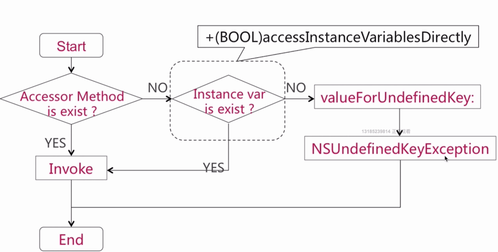

### KVC的相关面试题
#### valueforkey 的判断流程


首先会通过 Accessor Method判断选择器方法getter方法是否存在,存在则直接进行消息转发。否则则判断是否存在同名属性或成员变量，也会判断是否允许访问示例变量。如果为NO,则回调valueForUndefinedKey。


##### Accessor Method的判断


##### instane var 的判断


#### setValueforkey 的判断流程
大致的流程等同于 valueforkey 的判断流程


##### Accessor Method的判断

```
setKey:
```

##### instane var 的判断

