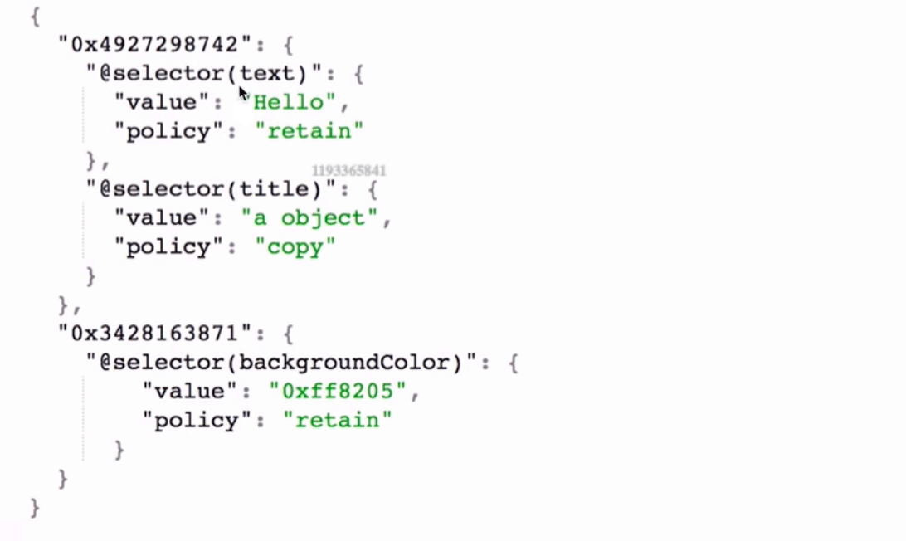

### 关联对象的相关面试题

#### 相关的函数

##### set


```objective-c
objc_setAssociatedObject(id _Nonnull object, const void * _Nonnull key,
                         id _Nullable value, objc_AssociationPolicy policy)
```


##### get


```objective-c
objc_getAssociatedObject(id _Nonnull object, const void * _Nonnull key)
```

##### remove

```objective-c
objc_removeAssociatedObjects(id _Nonnull object)
```


#### 实现的本质
关联对象的本质就是由AssociationsManager管理并在AssociationsHashMap中存储。

也就是说所有对象的关联内容都在同一个全局的容器中。


关联的结构如上图所示，首先由 关联对象的`obj`通过`DISGUISE`地址运算当做key，value对应一个`ObjectAssociationMap`的实例。 该实例包装了一个以sel为key, 内存管理方式和值为value的ObjcAssociation实例对象。


内存结构大致如下:



#### key的常见用法


```
static void *MyKey = &MyKey;
objc_setAssociatedObject(obj, MyKey, value, OBJC_ASSOCIATION_RETAIN_NONATOMIC)
objc_getAssociatedObject(obj, MyKey)

static char MyKey;
objc_setAssociatedObject(obj, &MyKey, value, OBJC_ASSOCIATION_RETAIN_NONATOMIC)
objc_getAssociatedObject(obj, &MyKey)

使用属性名作为key
objc_setAssociatedObject(obj, @"property", value, OBJC_ASSOCIATION_RETAIN_NONATOMIC);
objc_getAssociatedObject(obj, @"property");

使用get方法的@selecor作为key
objc_setAssociatedObject(obj, @selector(getter), value, OBJC_ASSOCIATION_RETAIN_NONATOMIC)
objc_getAssociatedObject(obj, @selector(getter))


```