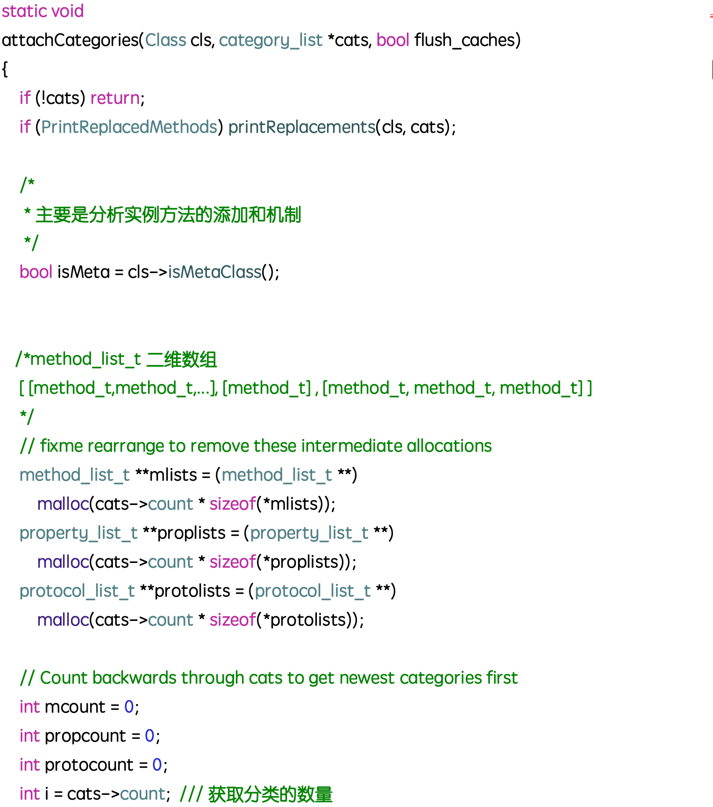
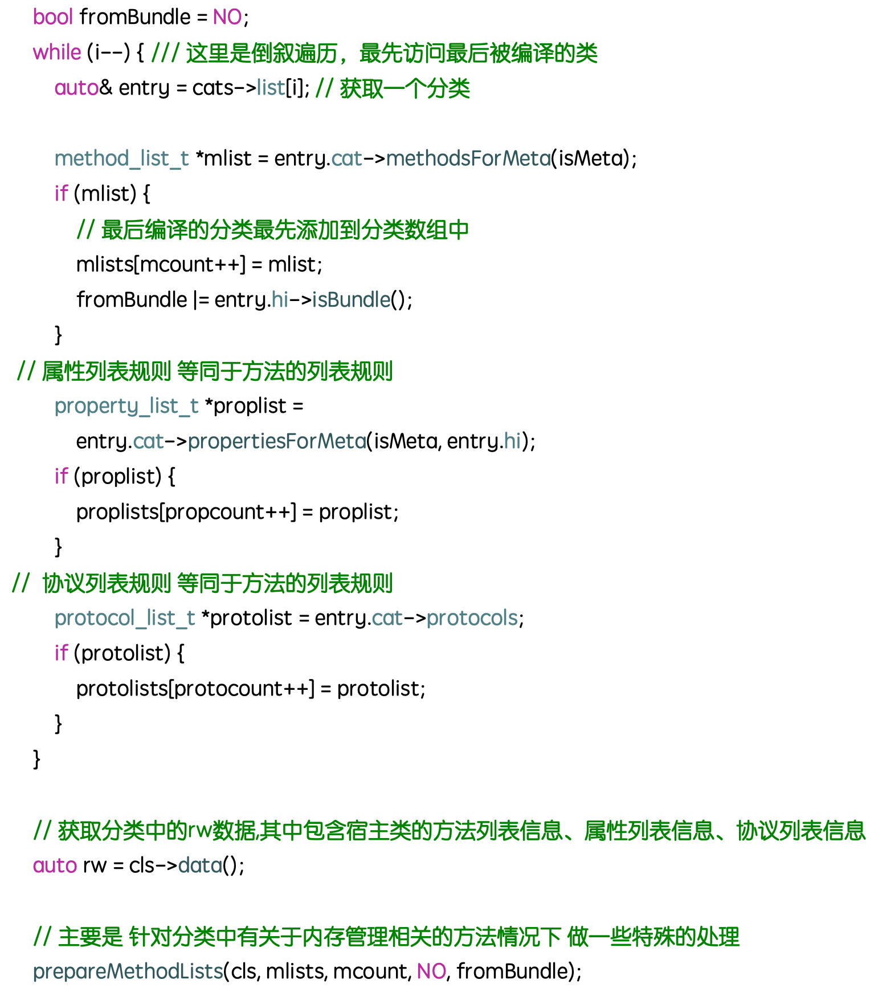
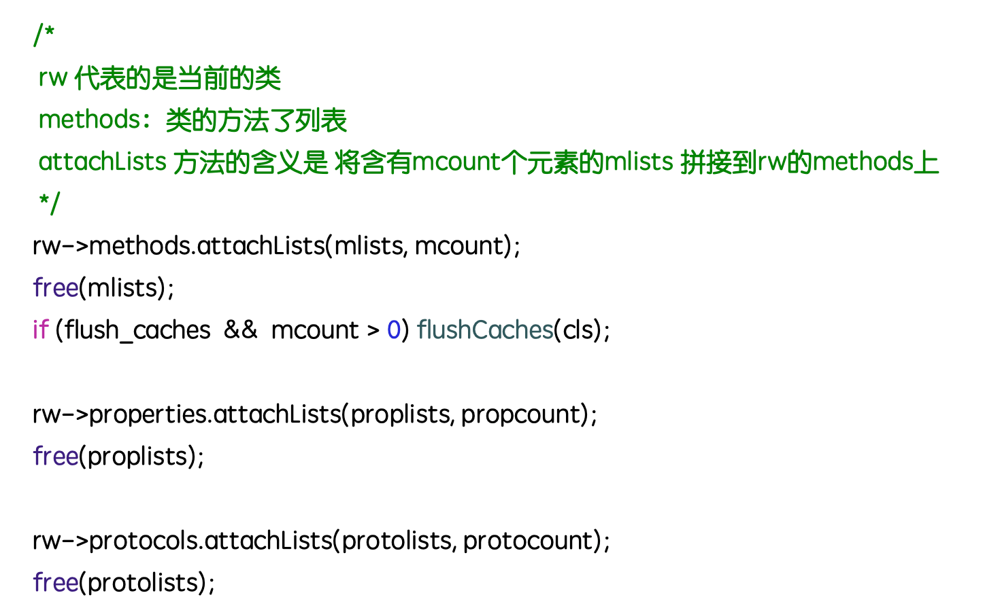
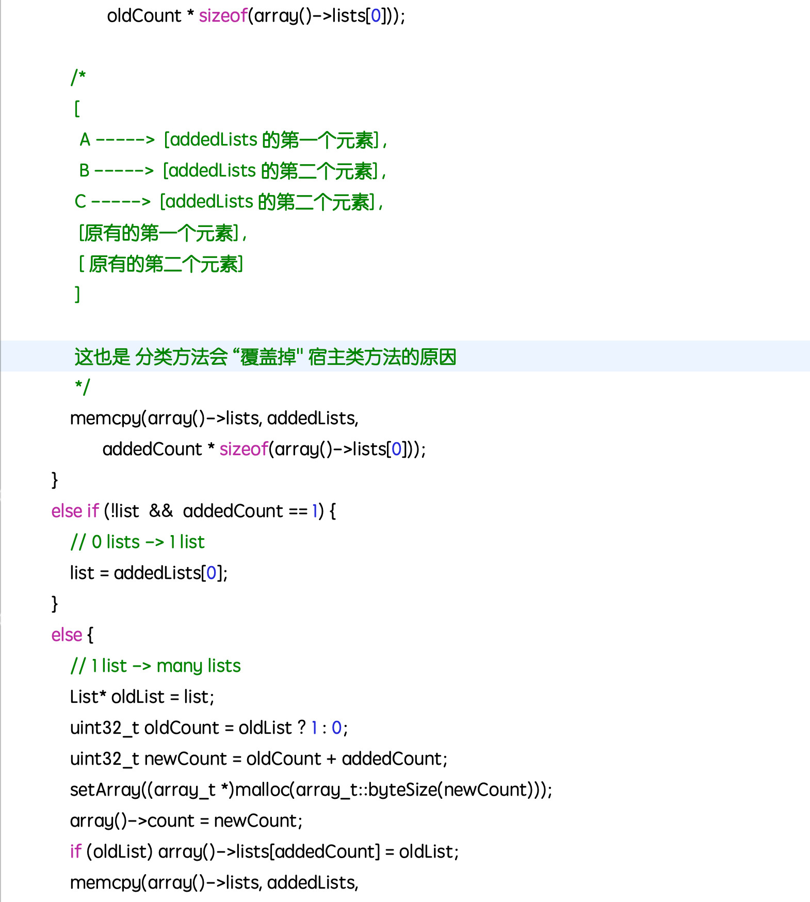

### 分类的相关的内容
#### 用分类都做了那些事情
1. 声明私有方法 (.m文件中)
2. 分解体积庞大的类文件
3. 把Framework的私有方法公开

#### 分类中可以添加哪些内容
1. 实例方法
2. 类方法
3. 协议
4. 属性(getter和setter 需要使用关联对象)

#### 分类的特点
1. 运行时决议
2. 名字相同的分类会引起编译的报错
3. 可以为系统类添加分类
4. 类扩展可以添加实例变量,分类不能添加实例变量
5. 分类添加的方法会”覆盖“掉宿主类的方法
6. 同名的分类方法谁能生效取决于编译的顺序

#### 分类的结构

name:分类的名称
cls:对应的宿主类
instanceMethods:实例方法的列表
clssMethods: 类方法的列表
protocols: 协议列表
instanceProperties: 实例属性列表

#### 加载的调用栈
##### remethodizeClass的主要实现

**在程序启动之后,会调用_objc_init方法，实际上就是runtime的初始化方法。然后加载一系列的方法，最终会加载分类。**

在`remethodizeClass`方法中,主要是通过 `unattachedCategoriesForClass`方法, 完成了对各个分类方法的加载,并赋值给到cats变量中,然后通过后续的 `attachCategories`方法,将当前的分类信息(cats)拼接到cls中。

##### attachCategories 的主要实现

##### attachLists 的主要实现

### 扩展相关面试题
#### 扩展一般用来做什么

* 声明私有属性
* 声明私有方法
* 声明私有成员变量

#### 扩展的特点

* 在编译时决议
* 只能以声明的方式存在,多数情况下寄生与宿主类的.m中
* 不能为系统类添加扩展

#### 扩展与分类的区别

https://juejin.im/entry/5880225a570c350062a9a842