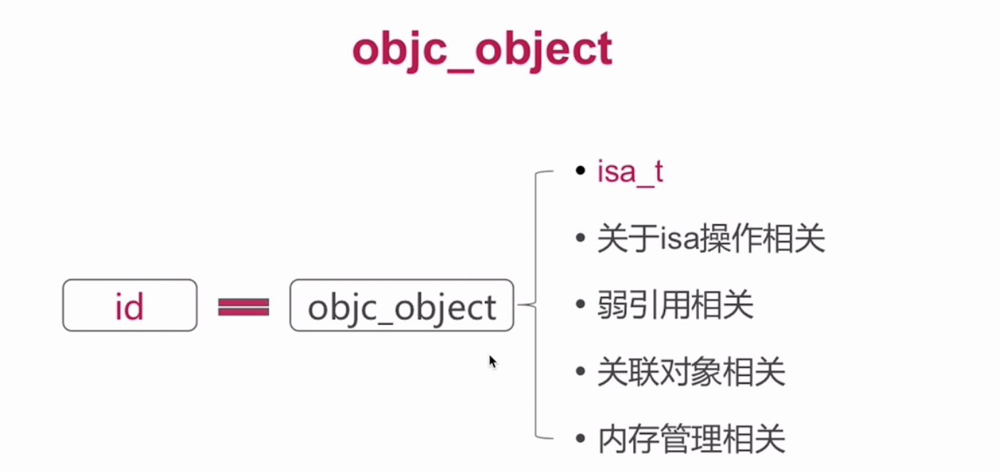
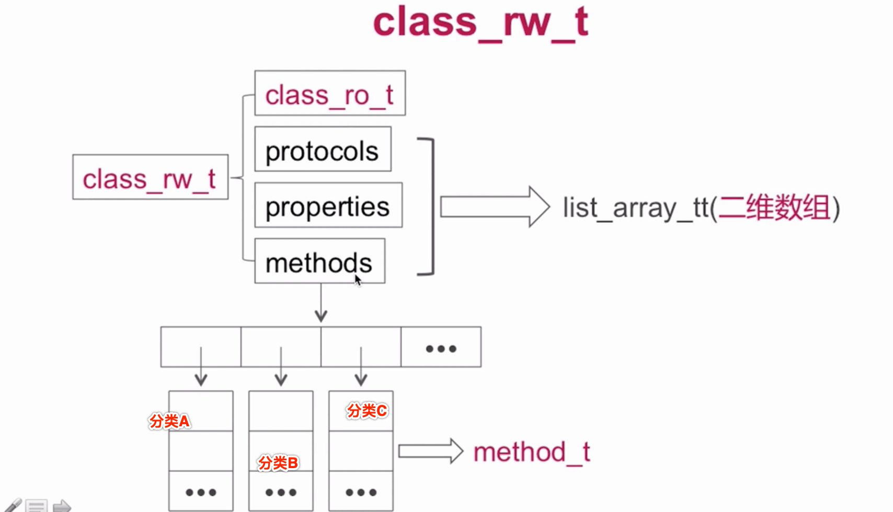
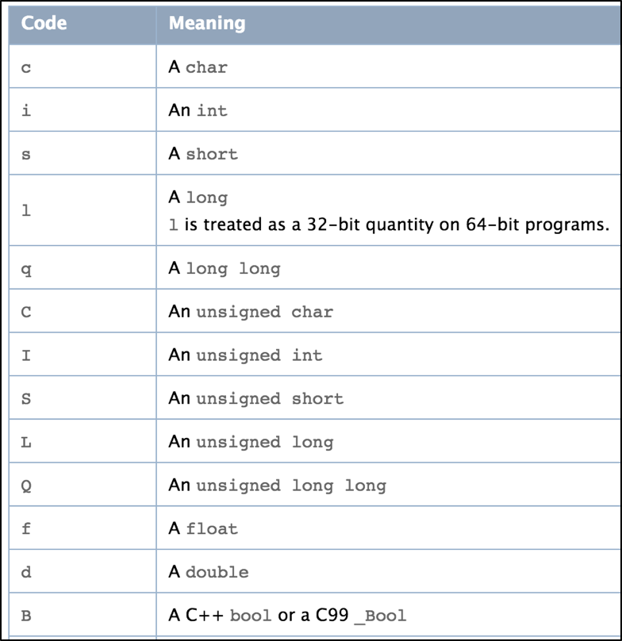
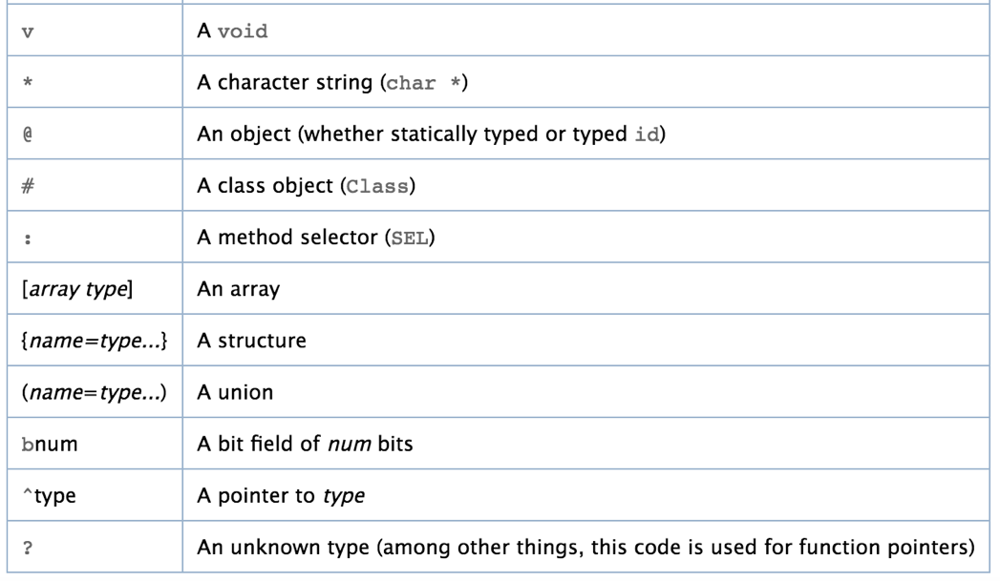

### Runtime的相关面试题
#### Runtime的数据结构
##### objc_object



在objc_object的结构体中,
* isa_t 是一个共用体
* 关于isa的操作, 比如通过是实例对象的isa指针获取类对象,通过类对象的isa指针获取元类对象
* 弱引用相关的方法, 比如:标记一个对象是否曾经有过弱引用
* 关联对象相关 比如:我们为这个对象设置了一些关联属性,那么关联属性的相关方法也在这里可以获取
* 内存管理: 内存管理的一些实现,比如:retain、release等


##### objc_class


首先objc_class继承自objc_object，所以也是一个对象。
* superClass 对应的父类
* cache 方法的缓存,进行消息的传递
* bits 关于对象的信息 变量属性、方法、协议等。


##### isa指针


共用体isa_t:32位或者64位的0或1.

##### isa指针的指向


##### cache_t


cache_t实际就是:
1. 用于快速查找方法执行的函数
2. 是可增量扩展的哈希表结构(提高查找效率)
3. 是计算机**局部性原理**的最佳应用


#####  class_data_bits_t


* **class_data_bits_t** 主要是对class_rw_t的封装
* **class_rw_t** 代表了类相关的读写信息、对class_ro_t的封装
* **class_ro_t** 代表了类相关的只读信息


##### class_rw_t



class_rw_t的methods等一般是一个二维数组，里面一般是存储着各个分类所对应的方法了列表、属性列表、协议列表。
##### class_ro_t


class_ro_t 作为类的只读数据,methodList等对应的一般是以为数组,包含了宿主类本身的方法列表、属性列表、协议列表等。

##### method_t


##### Type Encodings


[更多 Type Encodings :](https://developer.apple.com/library/archive/documentation/Cocoa/Conceptual/ObjCRuntimeGuide/Articles/ocrtTypeEncodings.html#//apple_ref/doc/uid/TP40008048-CH100-SW1)






#### Super的本质
super调用，底层会转换为`objc_msgSendSuper`函数的调用，接收2个参数:
* struct objc_super2
* SEL


* receiver是消息接收者
* current_class是receiver的Class对象


#### Runtime API01 – 类 

##### 动态创建一个类（参数：父类，类名，额外的内存空间）
Class objc_allocateClassPair(Class superclass, const char *name, size_t extraBytes)

##### 注册一个类（要在类注册之前添加成员变量）
void objc_registerClassPair(Class cls) 

##### 销毁一个类
void objc_disposeClassPair(Class cls)

##### 获取isa指向的Class
Class object_getClass(id obj)

##### 设置isa指向的Class
Class object_setClass(id obj, Class cls)

##### 判断一个OC对象是否为Class
BOOL object_isClass(id obj)

##### 判断一个Class是否为元类
BOOL class_isMetaClass(Class cls)

##### 获取父类
Class class_getSuperclass(Class cls)


#### Runtime API02 – 成员变量 

##### 获取一个实例变量信息
Ivar class_getInstanceVariable(Class cls, const char *name)

##### 拷贝实例变量列表（最后需要调用free释放）
Ivar *class_copyIvarList(Class cls, unsigned int *outCount)

##### 设置和获取成员变量的值
void object_setIvar(id obj, Ivar ivar, id value)
id object_getIvar(id obj, Ivar ivar)

##### 动态添加成员变量（已经注册的类是不能动态添加成员变量的）
BOOL class_addIvar(Class cls, const char * name, size_t size, uint8_t alignment, const char * types)

##### 获取成员变量的相关信息
const char *ivar_getName(Ivar v)
const char *ivar_getTypeEncoding(Ivar v)

#### Runtime API03 – 属性 

##### 获取一个属性
objc_property_t class_getProperty(Class cls, const char *name)

##### 拷贝属性列表（最后需要调用free释放）
objc_property_t *class_copyPropertyList(Class cls, unsigned int *outCount)

##### 动态添加属性
BOOL class_addProperty(Class cls, const char *name, const objc_property_attribute_t *attributes,
                  unsigned int attributeCount)

##### 动态替换属性
void class_replaceProperty(Class cls, const char *name, const objc_property_attribute_t *attributes,
                      unsigned int attributeCount)

##### 获取属性的一些信息
const char *property_getName(objc_property_t property)
const char *property_getAttributes(objc_property_t property)


#### Runtime API04 – 方法
##### 获得一个实例方法、类方法
Method class_getInstanceMethod(Class cls, SEL name)
Method class_getClassMethod(Class cls, SEL name)

##### 方法实现相关操作
IMP class_getMethodImplementation(Class cls, SEL name) 
IMP method_setImplementation(Method m, IMP imp)
void method_exchangeImplementations(Method m1, Method m2) 

##### 拷贝方法列表（最后需要调用free释放）
Method *class_copyMethodList(Class cls, unsigned int *outCount)

##### 动态添加方法
BOOL class_addMethod(Class cls, SEL name, IMP imp, const char *types)

##### 动态替换方法
IMP class_replaceMethod(Class cls, SEL name, IMP imp, const char *types)

##### 获取方法的相关信息（带有copy的需要调用free去释放）
`SEL method_getName(Method m)`

`IMP method_getImplementation(Method m)`

`const char *method_getTypeEncoding(Method m)`

`unsigned int method_getNumberOfArguments(Method m)`

`char *method_copyReturnType(Method m)`

`char *method_copyArgumentType(Method m, unsigned int index)`


##### 选择器相关
`const char *sel_getName(SEL sel)
SEL sel_registerName(const char *str)`

##### 用block作为方法实现
`IMP imp_implementationWithBlock(id block)`

`id imp_getBlock(IMP anImp)`

`BOOL imp_removeBlock(IMP anImp)`


####  LLVM中间代码
Objective-C在变为机器代码之前，会被LLVM编译器转换为中间代码（Intermediate Representation）
```
可以使用以下命令行指令生成中间代码
clang -emit-llvm -S main.m

语法简介
@ - 全局变量
% - 局部变量
alloca - 在当前执行的函数的堆栈帧中分配内存，当该函数返回到其调用者时，将自动释放内存
i32 - 32位4字节的整数
align - 对齐
load - 读出，store 写入
icmp - 两个整数值比较，返回布尔值
br - 选择分支，根据条件来转向label，不根据条件跳转的话类似 goto
label - 代码标签
call - 调用函数

```
具体可以参考官方文档：https://llvm.org/docs/LangRef.html