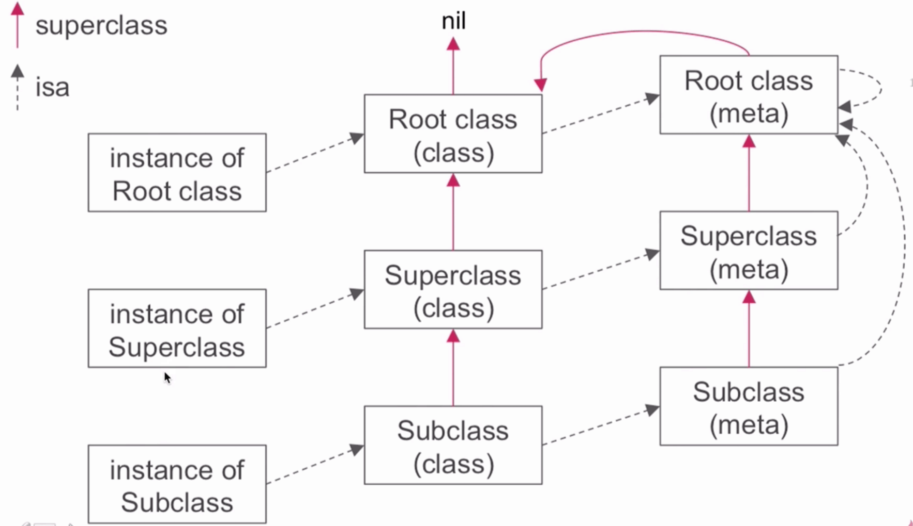
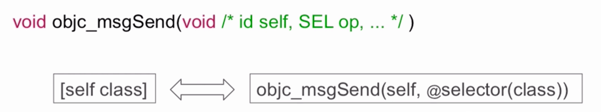
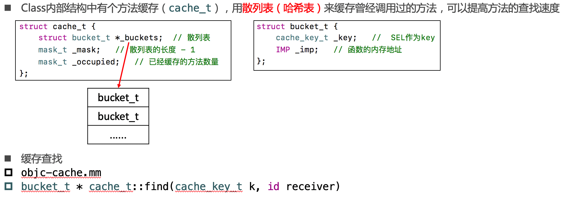

### 对象、类对象、元类对象
#### 简述
* 类对象存储着实例方法列表等信息
* 元类对象存储着类方法列表等信息
* 元类和类都继承自objc_object,所以都有isa指针,通过isa指针对象可以找到所对应的类对象,类对象可以找到对象的元类对象

**实例方法的查找**:当调用一个实例方法的时候，首先会通过isa指针找到类对象，在类对象里面查找，如果找不到则会沿着superClass想上一级查找，如果到根类还是查找不到，则会进入消息的转发流程。

**类方法的查找**:当调用一个类方法的时候，首先会通过isa指针找到对应的元类,在元类中进行查找，查找不到则会沿着superclass想上级查找，如果到根元类还是查找不到，**则会去跟类查找相关的实例方法**。

**即:根元类的superclass指向根类。**

### 消息传递
#### 函数原型
##### objc_msgsend

##### objc_msgsendsuper

#### 消息传递流程

##### 缓存查找(哈希查找)

##### 当前类中查找

##### 父类中查找

### 消息的转发流程
