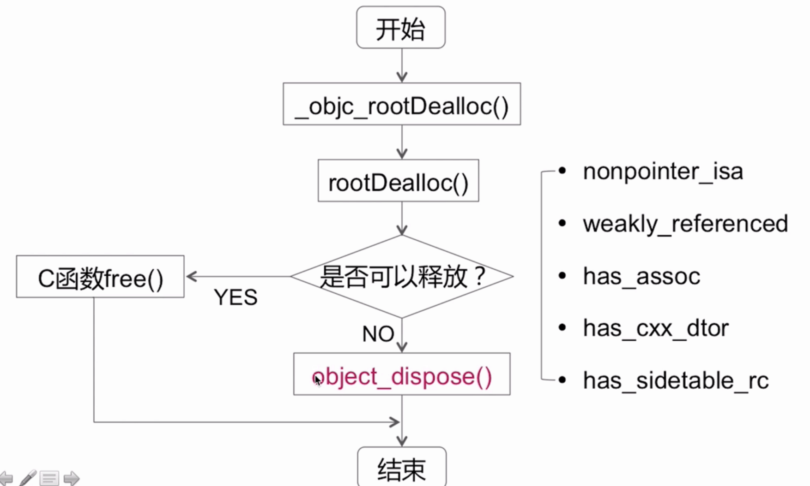
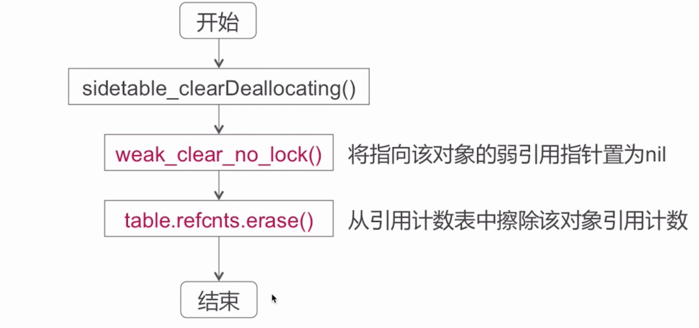

### 内存管理数据结构相关

#### 自旋锁(Spinlock_t)

*  Spinlock_t是盲等的锁
*  适用于轻量级的访问(引用计数的增减)

当前锁如果被其他线程获取, 那么这个线程会不断的去探测这个锁是否被释放, 如果被释放,则会第一时间获取这个锁。

不同于信号量,信号量在获取不到的时候, 会将此线程进行阻塞休眠,当其他线程释放的时候,唤醒恢复当前线程。

#### 引用计数表

引用计数表采用哈希表示为了提高查找效率。

size_t 本身第0位代表的是 是否存在弱引用, 第1位 表示该对象是否是正在释放中。
当计算引用计数的时候,size_t的值需要向右偏移两位。

#### 弱引用表

弱引用表实际上仍然是hash表,weak_entry_t是一个结构体,实际上存储着 (__weak修复的obj).

### 引用计数相关

#### alloc:
 经过了一系列的调用,最终调用了C函数的calloc. 此时并没有设置引用计数，但是通过获取retaincount则为1.
 
#### retain
 
 
 reain的实现中会经历两次的hash查找,找到对应的引用计数值，然后进行引用计数加1的操作。(实际上由于size_t计算需要偏移两位)
 
#### release
 
 
#### retaincount实现

 
 
#### dealloc的实现

 
 
 
 
 
##### objcet_dispose 实现
 
 
 
##### objc_destructInstance
 
 
##### clearDeallocating

  