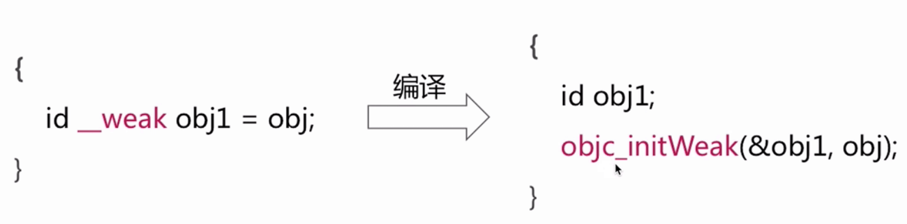

### 弱引用相关面试题
#### 弱引用实现
 
 
 在初始化的时候,runtime会调用**objc_initWeak**函数。初始化一个新的weak指针指向对象的地址。
 
#### 弱引用调用栈

 
 
 添加引用时,**objc_initWeak**函数会调用**objc_storeWeak**函数,**objc_storeWeak**的作用是更新指针指向,创建对应的弱引用表。最终通过hash算法,添加位置。
 
#### 清除弱引用调用栈

  
 
 