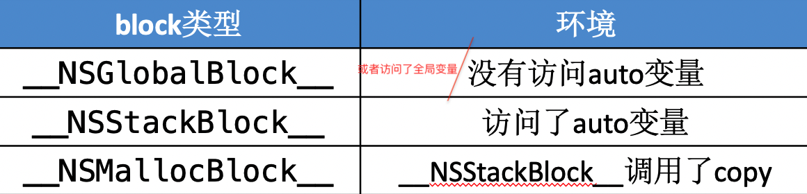
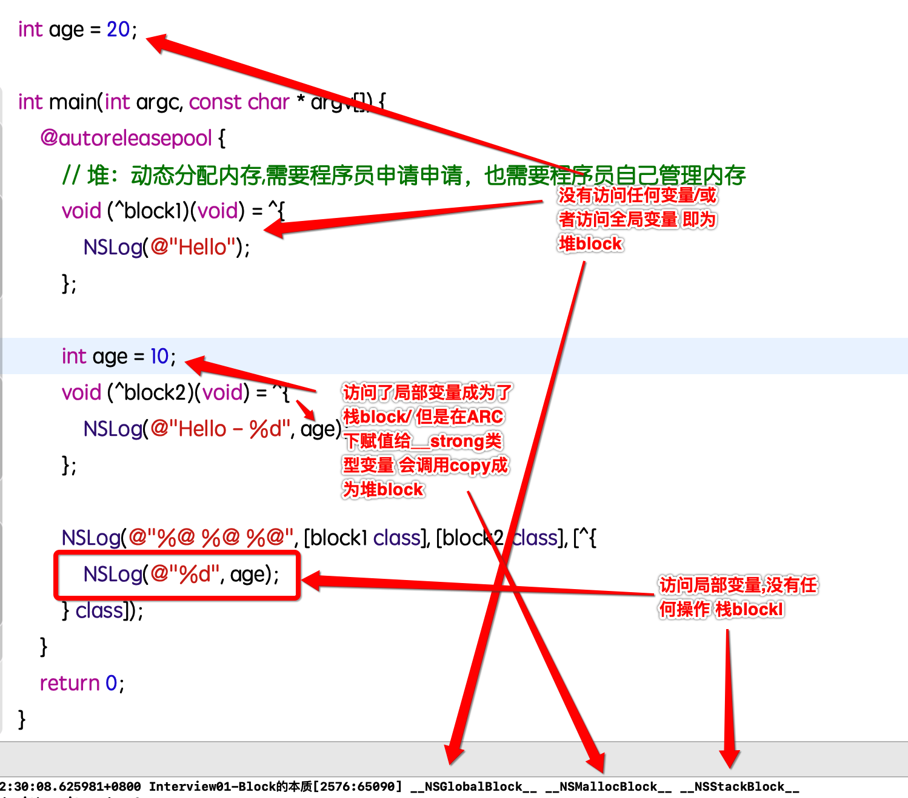

### Block面试题

#### block的原理是怎样的？本质是什么？
Block就是将**函数**及其**执行上下文**封装起来的**对象**。

```
block本质上也是一个OC对象，它内部也有个isa指针
block是封装了函数调用以及函数调用环境的OC对象
```
block的底层结构如下图所示:

 
 
#### Block的变量捕获
 为了保证block内部能够正常访问外部的变量，block有个变量捕获机制
 
 
 
 
#### Block的类型
block有3种类型，可以通过调用class方法或者isa指针查看具体类型，最终都是继承自[NSBlock](https://github.com/nst/iOS-Runtime-Headers/blob/master/Frameworks/CoreFoundation.framework/NSBlock.h)类型

__NSGlobalBlock__: https://github.com/nst/iOS-Runtime-Headers/blob/master/Frameworks/CoreFoundation.framework/__NSGlobalBlock.h

__NSStackBlock__: https://github.com/nst/iOS-Runtime-Headers/blob/master/Frameworks/CoreFoundation.framework/__NSStackBlock.h

__NSMallocBlock__: https://github.com/nst/iOS-Runtime-Headers/blob/master/Frameworks/CoreFoundation.framework/__NSMallocBlock.h

```
__NSGlobalBlock__（ _NSConcreteGlobalBlock ） 
__NSStackBlock__（ _NSConcreteStackBlock ）
__NSMallocBlock__ （ _NSConcreteMallocBlock ）
```


##### block类型确定
**MRC确定**



**ARC示例**



每一种类型的block调用copy后的结果如下所示:


#### block的copy

在ARC环境下，编译器会根据情况自动将栈上的block复制到堆上，比如以下情况：

1. block作为函数返回值时
2. 将block赋值给__strong指针时
3. block作为Cocoa API中方法名含有usingBlock的方法参数时
4. block作为GCD API的方法参数时


```
MRC下block属性的建议写法
@property (copy, nonatomic) void (^block)(void);

ARC下block属性的建议写法
@property (strong, nonatomic) void (^block)(void);
@property (copy, nonatomic) void (^block)(void);
```

#### 对象类型的auto变量

当block内部访问了对象类型的auto变量时
* 如果block是在栈上，将不会对auto变量产生强引用

如果block被拷贝到堆上
* 会调用block内部的copy函数
* copy函数内部会调用_Block_object_assign函数
_Block_object_assign函数会根据auto变量的修饰符（__strong、__weak、__unsafe_unretained）做出相应的操作，形成强引用（retain）或者弱引用

如果block从堆上移除

* 会调用block内部的dispose函数
dispose函数内部会调用_Block_object_dispose函数
_Block_object_dispose函数会自动释放引用的auto变量（release）


#### __weak的解决方案

```
在使用clang转换OC为C++代码时，可能会遇到以下问题
cannot create __weak reference in file using manual reference

解决方案：支持ARC、指定运行时系统版本，比如
xcrun -sdk iphoneos clang -arch arm64 -rewrite-objc -fobjc-arc -fobjc-runtime=ios-8.0.0 main.m
```


 