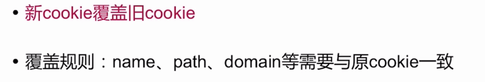
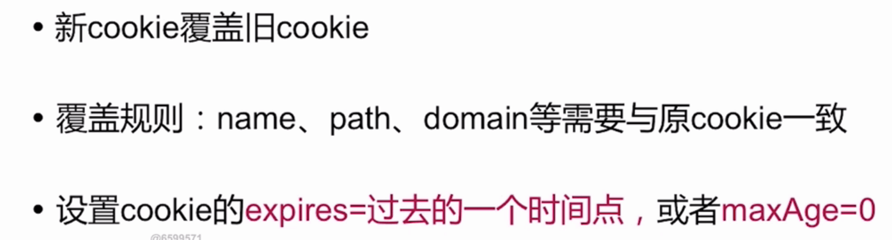

### Session、Cookie相关

**HTTP协议无状态的补偿**

#### Cookie

Cookie主要是用来记录用户状态,区分用户; **状态保存在客户端**

客户端发送的Cookie在http请求报文的Cookie首部字段中

服务器设置Http响应报文的Set-Cookie首部字段

##### 修改Cookie

 
 
##### 删除Cookie
 
  
  
##### 保证Cookie安全

#### Session

  Cookie也是用来记录用户状态,区分用户; **状态保存在服务器端**
  
  
#####  Session的工作流程
  

