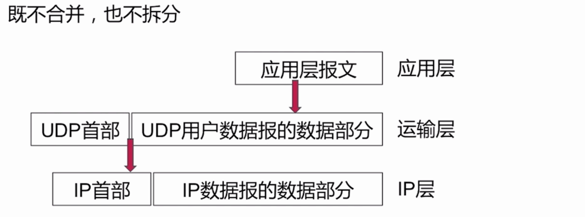

### TCP、UDP相关
#### TCP/UPD协议

 

##### UDP协议

###### 面向报文

##### UDP功能

* 复用、分用

* 差错检测

#### TCP相关

##### 面向连接

* 三次握手
 
 
 
*  四次挥手

 
##### 可靠传输
* 无差错
* 不丢失
* 不重复
* 按序到达

**停止等待协议**:

##### 面向字节流
 

##### 流量控制
 **滑动窗口协议**
 
 
 
 由接收窗口通过tcp里面的报文、首部字段当中来调整、或更改发送窗口的大小 发送的速率。
 
 
##### 拥塞控制

**慢开始、拥塞避免**

**快恢复、快重传**
 
 
 
 
 
 
#### 总结
 
 1、TCP面向连接（如打电话要先拨号建立连接）;UDP是无连接的，即发送数据之前不需要建立连接

2、TCP提供可靠的服务。也就是说，通过TCP连接传送的数据，无差错，不丢失，不重复，且按序到达;UDP尽最大努力交付，即不保证可靠交付

3、TCP面向字节流，实际上是TCP把数据看成一连串无结构的字节流;UDP是面向报文的

UDP没有拥塞控制，因此网络出现拥塞不会使源主机的发送速率降低（对实时应用很有用，如IP电话，实时视频会议等）

4、每一条TCP连接只能是点到点的;UDP支持一对一，一对多，多对一和多对多的交互通信

5、TCP首部开销20字节;UDP的首部开销小，只有8个字节
6、TCP的逻辑通信信道是全双工的可靠信道，UDP则是不可靠信道