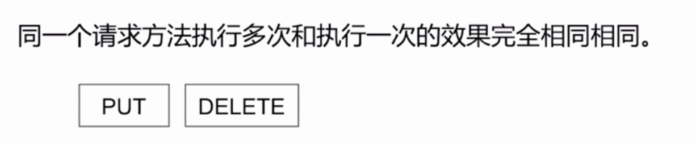

### HTTP 请求相关

#### 请求报文

 

#### 响应报文

#### 请求方式

#### GET和POST的区别

##### 安全性

##### 幂等性

##### 可缓存性

##### 链接建立流程

#### HTTP的特点

##### 持久链接
头部字段:
* Connection: keep-alive
* time : 20
* max : 10

###### 怎么判断一个请求的结束

##### Charles抓包原理

