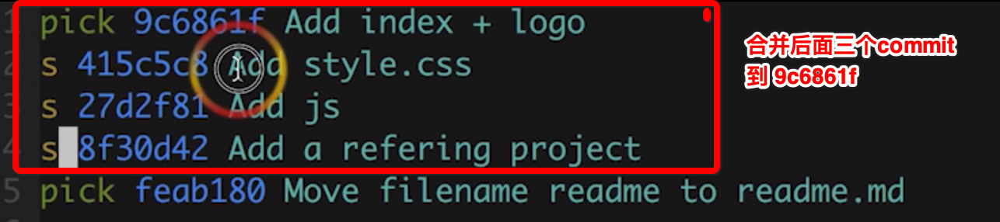

## git 基本的配置信息

### 配置全局用户信息


```
git gonfig --global user.name 'your_name'
git config --global user.email 'your_email@domain.com'
```

缺省等同于local


```
git config --local    /// 只对某个仓库有效
git config --global   /// 针对当前用户的所有仓库有效
git config --system   ///对系统登录的所有用户有效
```

显示config的配置，加 --list

```
git config --list --local
git config --list --global
git config --list --system
```


### 建立git仓库

已存在的项目

```
cd 项目代码所在的文件夹
git init
```

新建的项目


```
cd 文件夹
git init your_project
cd your_project
```

### 重命名

/// 重命名文件
```
mv readme readme.md
git add readme.md
git rm readme

```
等同于

```
git mv readme readme.md
```

### 查看版本历史记录


```
git log --oneline  /// 显示简洁的目录
git log -n4 --oneline /// 显示最近的四次提交记录
git branch -v /// 本地有多少分支
git commit -am "message" 暂存区直接提交
git log --all --graph /// 所有分支的演进历史

git cat-file -p commitid

```

### 删除分支

// 删除本地分支
```
 git branch -d branch_name
 git branch -D branch_name 
```

### 修改commit 信息

```
git commit --amend  /// 修改commit messgae
git rebase -i commit_id_parent ///修改历史commit信息 选择需要变动的commit_id的父节点
 
```




### git diff


```
git diff 暂存区与工作区的比较
git diff --cache 暂存区与head的比较
git diff temp master --index.html /// 比较两个分支的index文件
git checkout . /// 重置工作区
git checkout -- file_name ///重置工作区的文件
git rm  /// 删除文件
```