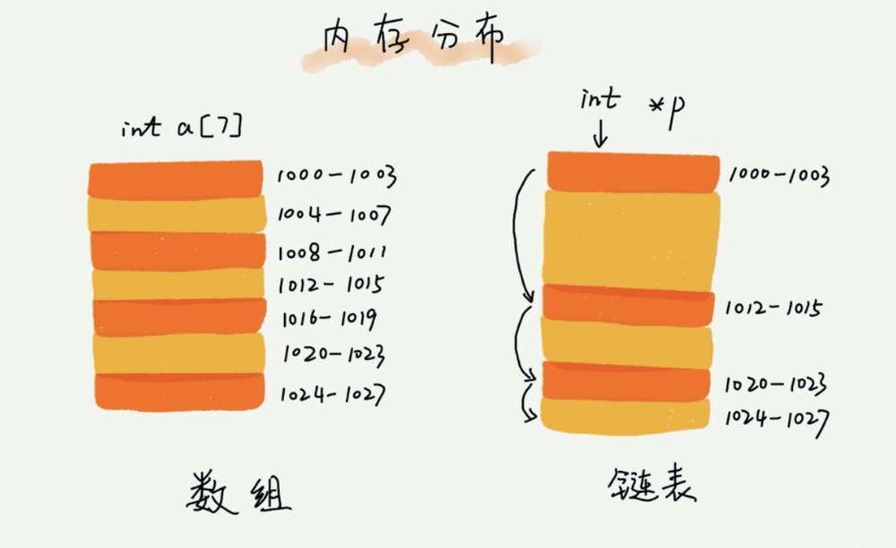
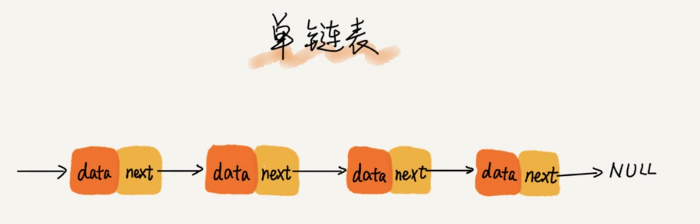
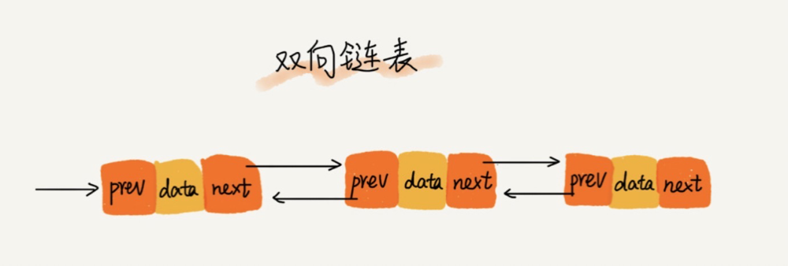
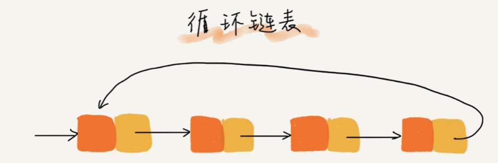
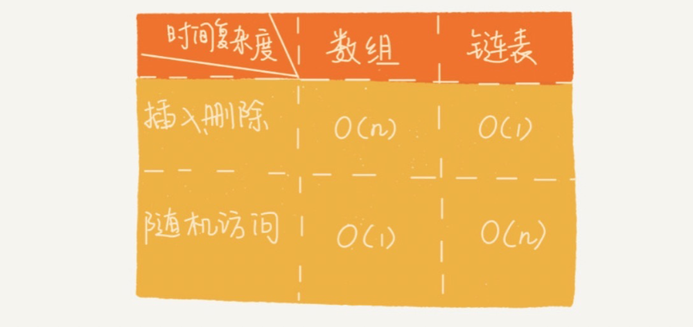

### 什么是链表
数组通常需要一块连续的内存空间来存储，对内存的要求比较高.而链表恰恰相反，它并不需要一块连续的内存空间，它通过“指针”将一组零散的内存块串联起来使用.

#### 单链表

链表通过指针将一组零散的内存块串联在一起。其中，我们把内存块称为链表的“结点”。为了将所有的结点串起来，每个链表的结点除了存储数据之外，还需要记录链上的下一个结点的地址。如图所示，我们把这个记录下个结点地址的指针叫作后继指针 next

从上面的单链表图中，你应该可以发现，其中有两个结点是比较特殊的，它们分别是第一个结点和最后一个结点。我们习惯性地把第一个结点叫作头结点，把最后一个结点叫作尾结点。其中，头结点用来记录链表的基地址。有了它，我们就可以遍历得到整条链表。而尾结点特殊的地方是：指针不是指向下一个结点，而是指向一个空地址 NULL，表示这是链表上最后一个结点。

#### 双向链表

单向链表只有一个方向，结点只有一个后继指针 next 指向后面的结点。而双向链表，顾名思义，它支持两个方向，每个结点不止有一个后继指针 next 指向后面的结点，还有一个前驱指针 prev 指向前面的结点。

双向链表需要额外的两个空间来存储后继结点和前驱结点的地址。所以，如果存储同样多的数据，双向链表要比单链表占用更多的内存空间。虽然两个指针比较浪费存储空间，但可以支持双向遍历，这样也带来了双向链表操作的灵活性.

**Java 语言的LinkedHashMap的实现原理，用到了双向链表这种数据结构。**

#### 循环链表

循环链表是一种特殊的单链表,它跟单链表唯一的区别就在尾结点。我们知道，单链表的尾结点指针指向空地址，表示这就是最后的结点了。而循环链表的尾结点指针是指向链表的头结点。

循环链表的优点是从链尾到链头比较方便。当要处理的数据具有环型结构特点时，就特别适合采用循环链表。

### 关键词
#### 性能比拼
  
数组和链表是两种截然不同的内存组织方式。正是因为内存存储的区别，它们插入、删除、随机访问操作的时间复杂度正好相反。

不过，数组和链表的对比，并不能局限于时间复杂度。而且，在实际的软件开发中，不能仅仅利用复杂度分析就决定使用哪个数据结构来存储数据。

数组简单易用，在实现上使用的是连续的内存空间，可以借助 CPU 的缓存机制，预读数组中的数据，所以访问效率更高。而链表在内存中并不是连续存储，所以对 CPU 缓存不友好，没办法有效预读。

#### 如何基于链表实现 LRU 缓存淘汰算法？

我们维护一个有序单链表，越靠近链表尾部的结点是越早之前访问的。当有一个新的数据被访问时，我们从链表头开始顺序遍历链表。

+ 如果此数据之前已经被缓存在链表中了，我们遍历得到这个数据对应的结点，并将其从原来的位置删除，然后再插入到链表的头部

+ 如果此数据没有在缓存链表中，又可以分为两种情况：
  + 如果此时缓存未满，则将此结点直接插入到链表的头部
  + 如果此时缓存已满，则链表尾结点删除，将新的数据结点插入链表的头部

> 实际上，我们可以继续优化这个实现思路，比如引入散列表（Hash table）来记录每个数据的位置，将缓存访问的时间复杂度降到 O(1)。  

#### 留意边界处理

+ 如果链表为空时，代码是否能正常工作？
+ 如果链表只包含一个结点时，代码是否能正常工作？
+ 如果链表只包含两个结点时，代码是否能正常工作？
+ 代码逻辑在处理头结点和尾结点的时候，是否能正常工作？