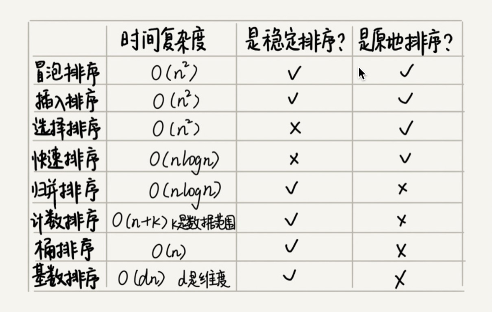

### 如何实现一个通用的、高性能的排序函数？

#### 如何选择合适的排序算法？

如果对小规模数据进行排序，可以选择时间复杂度是 O(n2) 的算法；如果对大规模数据进行排序，时间复杂度是 O(nlogn) 的算法更加高效。所以，为了兼顾任意规模数据的排序，一般都会首选时间复杂度是 O(nlogn) 的排序算法来实现排序函数。

#### 如何优化快速排序？

如果数据原来就是有序的或者接近有序的，每次分区点都选择最后一个数据，那快速排序算法就会变得非常糟糕，时间复杂度就会退化为 O(n2)。实际上，这种 O(n2) 时间复杂度出现的主要原因还是因为我们分区点选的不够合理。

最理想的分区点是：**被分区点分开的两个分区中，数据的数量差不多**

如果很粗暴地直接选择第一个或者最后一个数据作为分区点，不考虑数据的特点，肯定会出现之前讲的那样，在某些情况下，排序的最坏情况时间复杂度是 O(n2)。为了提高排序算法的性能，我们也要尽可能地让每次分区都比较平均。

- 三数取中法

 我们从区间的首、尾、中间，分别取出一个数，然后对比大小，取这 3 个数的中间值作为分区点。这样每间隔某个固定的长度，取数据出来比较，将中间值作为分区点的分区算法，肯定要比单纯取某一个数据更好。但是，如果要排序的数组比较大，那“三数取中”可能就不够了，可能要“五数取中”或者“十数取中”。

 - 随机法

 随机法就是每次从要排序的区间中，随机选择一个元素作为分区点。这种方法并不能保证每次分区点都选的比较好，但是从概率的角度来看，也不大可能会出现每次分区点都选的很差的情况，所以平均情况下，这样选的分区点是比较好的。时间复杂度退化为最糟糕的 O(n2) 的情况，出现的可能性不大。

 递归要警惕堆栈溢出。为了避免快速排序里，递归过深而堆栈过小，导致堆栈溢出，我们有两种解决办法：第一种是限制递归深度。一旦递归过深，超过了我们事先设定的阈值，就停止递归。第二种是通过在堆上模拟实现一个函数调用栈，手动模拟递归压栈、出栈的过程，这样就没有了系统栈大小的限制。

 对于小规模数据的排序，O(n2) 的排序算法并不一定比 O(nlogn) 排序算法执行的时间长。对于小数据量的排序，我们选择比较简单、不需要递归的插入排序算法。

 ### 关键点
.NET里面的Array排序实现:

1 三个以内的，直接比较，交换进行实现 

2 大于3个小于16个的，用的是插入排序进行的实现 

3 对于大于16，并且深度限制是0的，用的是堆排序实现的

4 对于大于15，并且深度限制不是0的，使用的是快速排序;