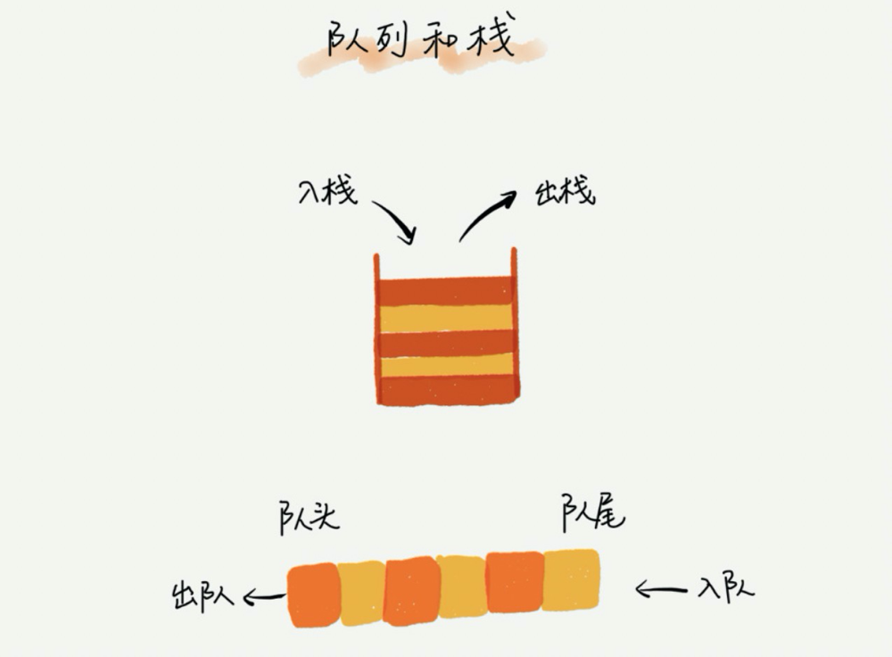

### 什么是栈?
后进者先出，先进者后出，这就是典型的“栈”结构.

从栈的操作特性上来看，栈是一种“操作受限”的线性表，只允许在一端插入和删除数据.

栈既可以用数组来实现，也可以用链表来实现。用数组实现的栈，我们叫作顺序栈，用链表实现的栈，我们叫作链式栈

### 什么是队列?
先进者先出，这就是典型的“队列”。

栈只支持两个基本操作：入栈 push()和出栈 pop()。队列跟栈非常相似，支持的操作也很有限，最基本的操作也是两个：入队 enqueue()，放一个数据到队列尾部；出队 dequeue()，从队列头部取一个元素。

跟栈一样，队列可以用数组来实现，也可以用链表来实现。用数组实现的栈叫作顺序栈，用链表实现的栈叫作链式栈。同样，用数组实现的队列叫作顺序队列，用链表实现的队列叫作链式队列。

