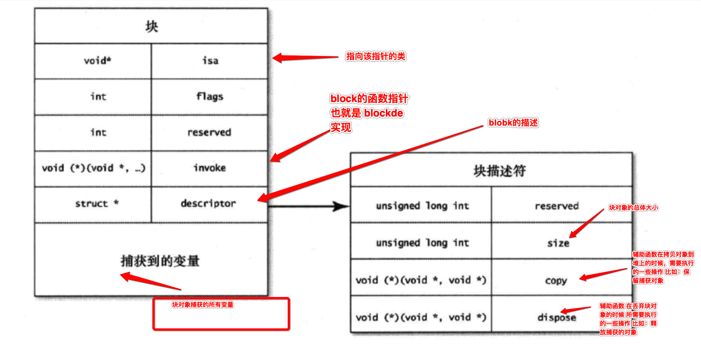
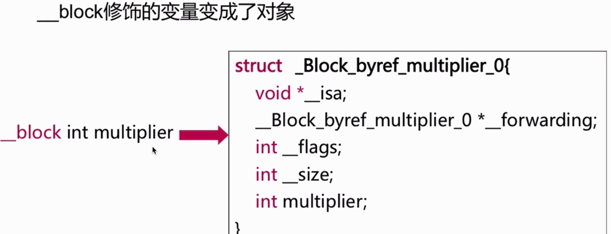
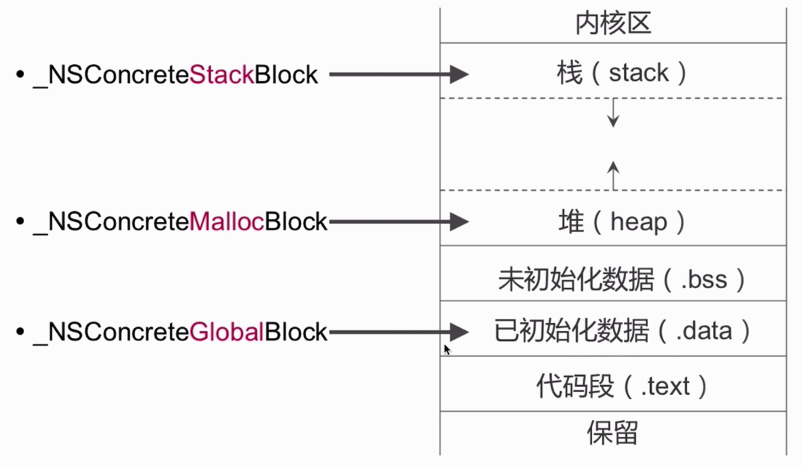
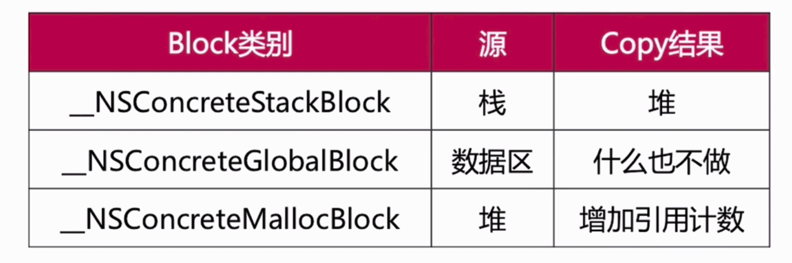
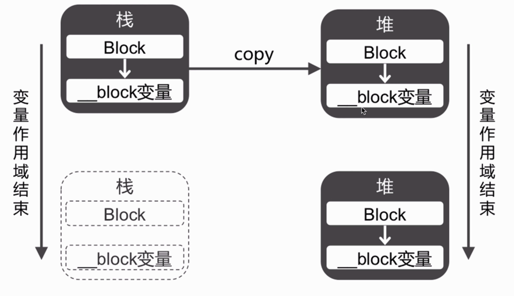
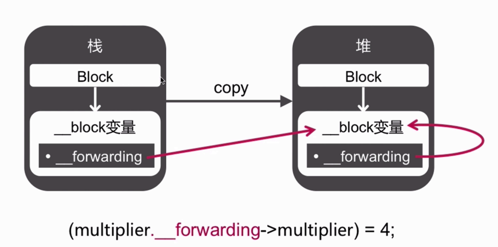

### [Block的本质](https://lvchenqiang.github.io/lvchenqiang.github.io/2016/11/06/Block/)
 
#### 什么是block?
 Block就是将**函数**及其**执行上下文**封装起来的**对象**。
 
 
 
 
#### 截获变量


#### __Block修饰符





```
__block可以用于解决block内部无法修改auto变量值的问题

__block不能修饰全局变量、静态变量（static）

编译器会将__block变量包装成一个对象

```


### Block的内存管理

#### Block的内存位置


#### Block的Copy操作



#### Block的销毁



在MRC的环境下,如果栈上的Block执行Copy之后,如果堆上的Block不做处理,则会造成内存释放。

#### __block变量Copy操作



栈上Block的变量,在执行copy操作后。会在堆上产生一个`__block变量`,开辟新的内存空间。此时,栈上的`__block变量`的`__forwarding`指针指向堆上的`__block变量`,堆上的`__block变量`的`__forwarding`指针指向自己。

所以,修改栈上的`__block变量`的值,会通过`__forwarding`指针找到堆上的`__block变量` 然后修改其值。


#### __forwarding存在的意义

不论在任何内存位置,都可以顺利的访问同一个`__block变量`。


#### 对象类型的auto变量、__block变量


```
当block在栈上时，对它们都不会产生强引用

当block拷贝到堆上时，都会通过copy函数来处理它们
__block变量（假设变量名叫做a）
_Block_object_assign((void*)&dst->a, (void*)src->a, 8/*BLOCK_FIELD_IS_BYREF*/);

对象类型的auto变量（假设变量名叫做p）
_Block_object_assign((void*)&dst->p, (void*)src->p, 3/*BLOCK_FIELD_IS_OBJECT*/);

当block从堆上移除时，都会通过dispose函数来释放它们
__block变量（假设变量名叫做a）
_Block_object_dispose((void*)src->a, 8/*BLOCK_FIELD_IS_BYREF*/);

对象类型的auto变量（假设变量名叫做p）
_Block_object_dispose((void*)src->p, 3/*BLOCK_FIELD_IS_OBJECT*/);


```

