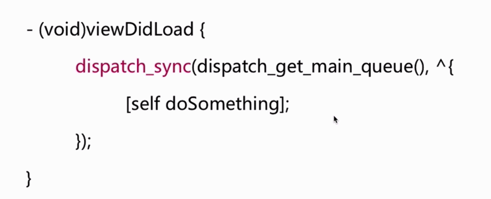
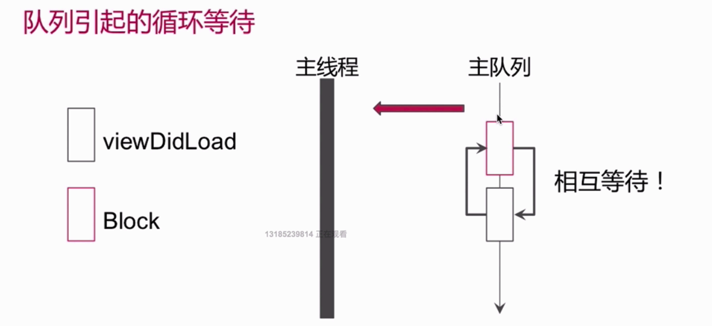
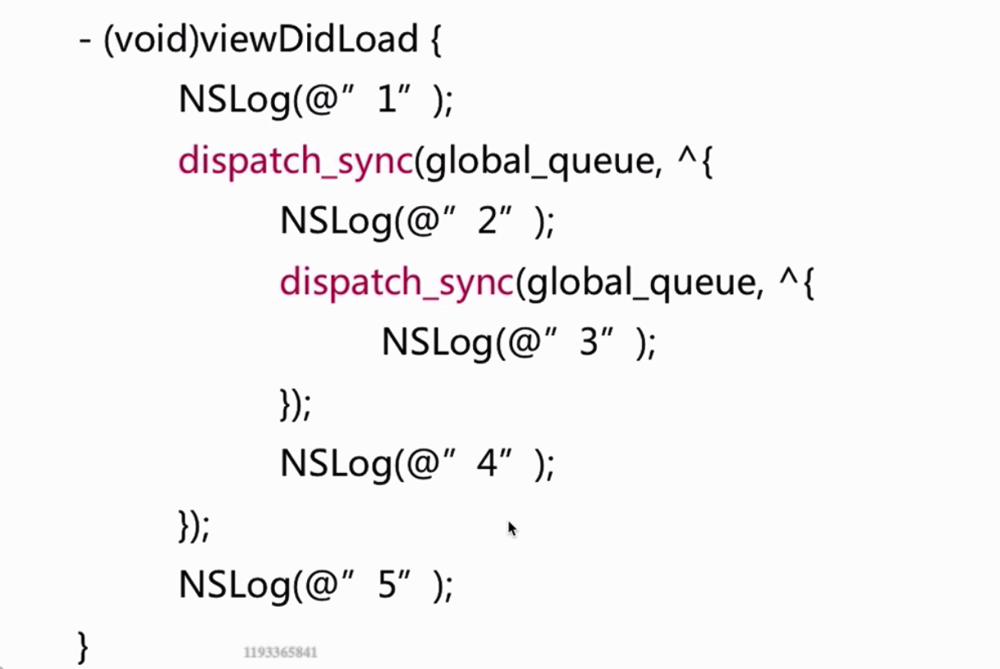
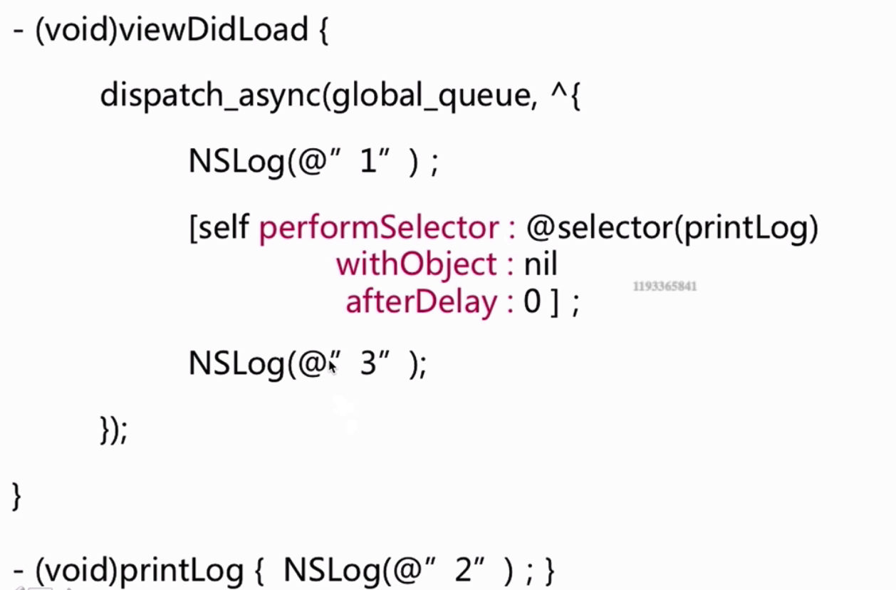

### GCD相关

#### 同步/异步 串行/并发
##### 同步串行
不会开启新的线程,在当前线程执行任务。任务是串行的,执行完一个任务,接着执行下一个任务。

##### 异步串行
会开启新的线程,但是任务是串行的,所以会执行完一个任务,接着执行下一个任务。

##### 同步并发
在当前线程执行任务,不会开启新线程。执行完一个任务,接着执行下一个任务。

##### 异步并发
可以开启多个线程,任务交替执行。

 
 
#### dispatch_async
异步函数，这个函数会立即返回，不做任何等待，它所指定的block“非同步地”追加到指定的队列中

####   dispatch_sync
同步函数，这个函数不会立即返回，它会一直等待追加到特定队列中的制定block完成工作后才返回，所以它的目的（也是效果）是阻塞当前线程

#### 面试题 死锁1






#### 面试题 2




```
输出结果: 1 2 3 4 5 
```


#### 面试题3



```
输出结果: 1  3 
```


### dispatch_barrier_async


```
#import "UserCenter.h"

@interface UserCenter()
{
    // 定义一个并发队列
    dispatch_queue_t concurrent_queue;
    
    // 用户数据中心, 可能多个线程需要数据访问
    NSMutableDictionary *userCenterDic;
}

@end
```


```
// 多读单写模型
@implementation UserCenter

- (id)init
{
    self = [super init];
    if (self) {
        // 通过宏定义 DISPATCH_QUEUE_CONCURRENT 创建一个并发队列
        concurrent_queue = dispatch_queue_create("read_write_queue", DISPATCH_QUEUE_CONCURRENT);
        // 创建数据容器
        userCenterDic = [NSMutableDictionary dictionary];
    }
    
    return self;
}

- (id)objectForKey:(NSString *)key
{
    __block id obj;
    // 同步读取指定数据
    dispatch_sync(concurrent_queue, ^{
        obj = [userCenterDic objectForKey:key];
    });
    
    return obj;
}

- (void)setObject:(id)obj forKey:(NSString *)key
{
    // 异步栅栏调用设置数据
    dispatch_barrier_async(concurrent_queue, ^{
        [userCenterDic setObject:obj forKey:key];
    });
}

@end
```