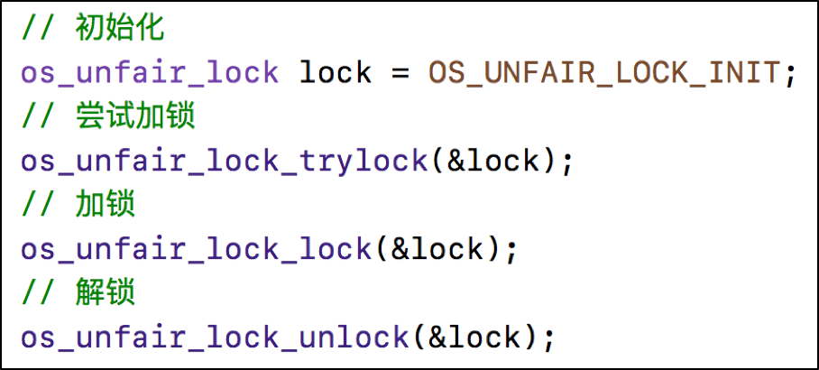
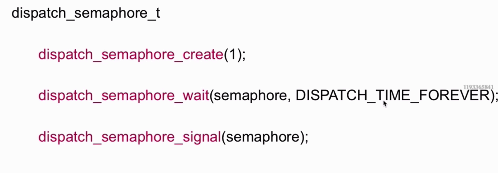
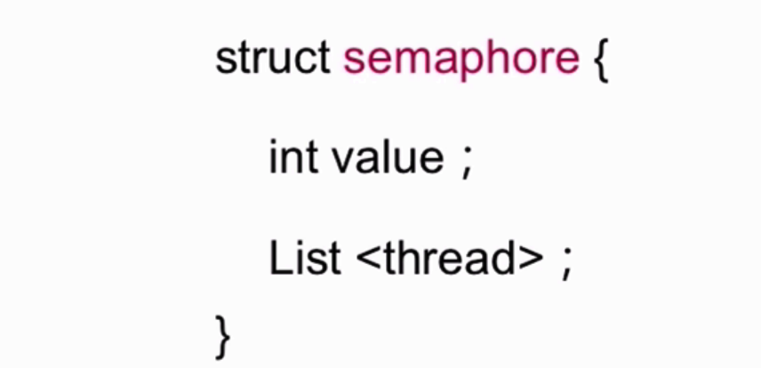
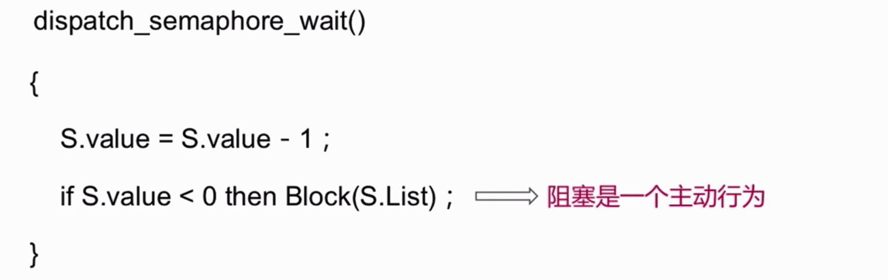
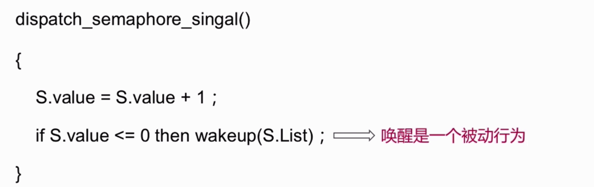
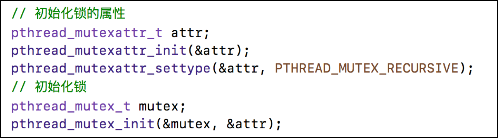
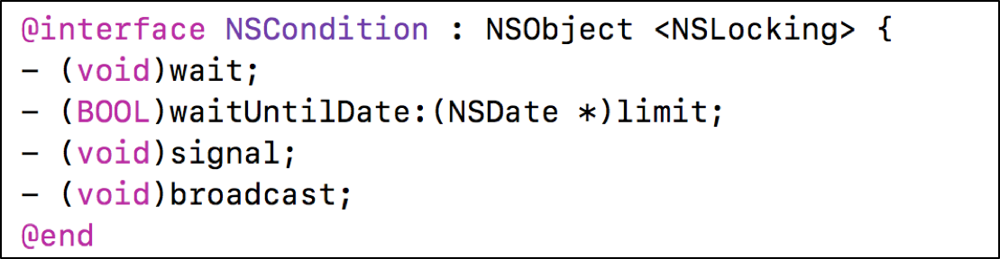
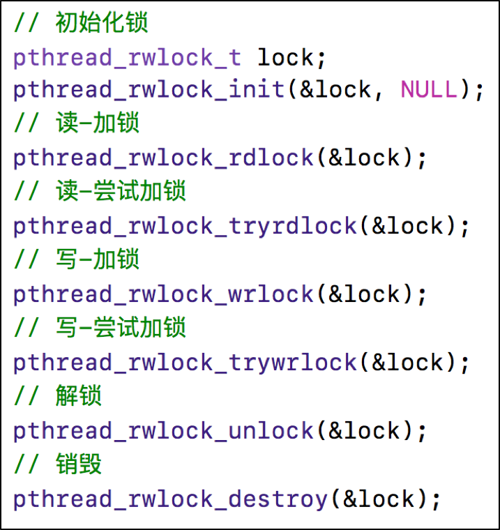

### 锁相关 

#### [synchronized](http://yulingtianxia.com/blog/2015/11/01/More-than-you-want-to-know-about-synchronized/)
一般在创建单例对象的时候使用,但是不是绝对安全的。

我们知道 @synchronized 后面需要紧跟一个 OC 对象，它实际上是把这个对象当做锁来使用。这是通过一个哈希表来实现的，OC 在底层使用了一个互斥锁的数组(你可以理解为锁池)，通过对对象去哈希值来得到对应的互斥锁。


```
互斥锁 休眠
自旋锁 忙等
```


*  `@synchronized`是对mutex递归锁的封装
* 源码查看：objc4中的`objc-sync.mm`文件
* `@synchronized(obj)`内部会生成obj对应的递归锁，然后进行加锁、解锁操作

 
#### OSSpinLock

 
*  OSSpinLock叫做”自旋锁”，等待锁的线程会处于忙等（busy-wait）状态，一直占用着CPU资源
 
* 目前已经不再安全，可能会出现优先级反转问题
* 如果等待锁的线程优先级较高，它会一直占用着CPU资源，优先级低的线程就无法释放锁
* 需要导入头文件`#import <libkern/OSAtomic.h>`

##### 特点
 


 
  
  OSSpinLock 现在已经**不再安全**，主要原因发生在低优先级线程拿到锁时，高优先级线程进入忙等(busy-wait)状态，消耗大量 CPU 时间，从而导致低优先级线程拿不到 CPU 时间，也就无法完成任务并释放锁。这种问题被称为**优先级反转**。
  
  
  
  
为什么忙等会导致低优先级线程拿不到时间片？这还得从操作系统的线程调度说起。

现代操作系统在管理普通线程时，通常采用`时间片轮转算法`(Round Robin，简称 RR)。每个线程会被分配一段时间片(quantum)，通常在 10-100 毫秒左右。当线程用完属于自己的时间片以后，就会被操作系统挂起，放入等待队列中，直到下一次被分配时间片。

##### 自旋锁的实现原理
自旋锁的目的是为了确保临界区只有一个线程可以访问，它的使用可以用下面这段伪代码来描述:


```c
do {  
    Acquire Lock
        Critical section  // 临界区
    Release Lock
        Reminder section // 不需要锁保护的代码
}
```

在 Acquire Lock 这一步，我们申请加锁，目的是为了保护临界区(Critical Section) 中的代码不会被多个线程执行。

自旋锁的实现思路很简单，理论上来说只要定义一个全局变量，用来表示锁的可用情况即可，伪代码如下
  
  
```c
bool lock = false; // 一开始没有锁上，任何线程都可以申请锁  
do {  
    while(lock); // 如果 lock 为 true 就一直死循环，相当于申请锁
    lock = true; // 挂上锁，这样别的线程就无法获得锁
        Critical section  // 临界区
    lock = false; // 相当于释放锁，这样别的线程可以进入临界区
        Reminder section // 不需要锁保护的代码        
}
```

注释写得很清楚，就不再逐行分析了。可惜这段代码存在一个问题: 如果一开始有多个线程同时执行 while 循环，他们都不会在这里卡住，而是继续执行，这样就无法保证锁的可靠性了。解决思路也很简单，只要确保申请锁的过程是原子操作即可。

#### os_unfair_lock
* os_unfair_lock用于取代不安全的OSSpinLock ，从iOS10开始才支持
* 从底层调用看，等待os_unfair_lock锁的线程会处于休眠状态，并非忙等
* 需要导入头文件`#import<os/lock.h>`




#### 原子操作（atomic）

 
狭义上的`原子操作`表示一条不可打断的操作，也就是说线程在执行操作过程中，不会被操作系统挂起，而是一定会执行完。在单处理器环境下，一条汇编指令显然是原子操作，因为中断也要通过指令来实现。

然而在多处理器的情况下，能够被多个处理器同时执行的操作任然算不上原子操作。因此，真正的原子操作必须由硬件提供支持，比如 x86 平台上如果在指令前面加上 “LOCK” 前缀，对应的机器码在执行时会把总线锁住，使得其他 CPU不能再执行相同操作，从而从硬件层面确保了操作的原子性
 
 这些非常底层的概念无需完全掌握，我们只要知道上述申请锁的过程，可以用一个原子性操作 `test_and_set` 来完成，它用伪代码可以这样表示
 
 
```c
bool test_and_set (bool *target) {  
    bool rv = *target; 
    *target = TRUE; 
    return rv;
}
```
 
 这段代码的作用是把 target 的值设置为 1，并返回原来的值。当然，在具体实现时，它通过一个原子性的指令来完成。
 
##### 自旋锁的总结
至此，自旋锁的实现原理就很清楚了


```c

bool lock = false; // 一开始没有锁上，任何线程都可以申请锁  
do {  
    while(test_and_set(&lock); // test_and_set 是一个原子操作
        Critical section  // 临界区
    lock = false; // 相当于释放锁，这样别的线程可以进入临界区
        Reminder section // 不需要锁保护的代码        
}

``` 
 如果临界区的执行时间过长，使用自旋锁不是个好主意。之前我们介绍过时间片轮转算法，线程在多种情况下会退出自己的时间片。其中一种是用完了时间片的时间，被操作系统强制抢占。除此以外，当线程进行 I/O 操作，或进入睡眠状态时，都会主动让出时间片。显然在 while 循环中，线程处于忙等状态，白白浪费 CPU 时间，最终因为超时被操作系统抢占时间片。如果临界区执行时间较长，比如是文件读写，这种忙等是毫无必要的
 
 


#### dispatch_semaphore

semaphore叫做”信号量”
信号量的初始值，可以用来控制线程并发访问的最大数量
信号量的初始值为1，代表同时只允许1条线程访问资源，保证线程同步





##### dispatch_semaphore_create



实例化一个semaphore的结构体, 其中维护了两个值,一个是信号量的值,一个是对象的线程的列表或者说一个队列。

##### dispatch_semaphore_wait



##### dispatch_semaphore_signal




#### pthread_mutex

1. mutex叫做”互斥锁”，等待锁的线程会处于休眠状态
2. 需要导入头文件#import <pthread.h>


pthread 表示 POSIX thread，定义了一组跨平台的线程相关的 API，pthread_mutex 表示互斥锁。互斥锁的实现原理与信号量非常相似，不是使用忙等，而是阻塞线程并睡眠，需要进行上下文切换.


互斥锁的常见用法:


```objective-c
pthread_mutexattr_t attr;  
pthread_mutexattr_init(&attr);  
pthread_mutexattr_settype(&attr, PTHREAD_MUTEX_NORMAL);  // 定义锁的属性

pthread_mutex_t mutex;  
pthread_mutex_init(&mutex, &attr) // 创建锁

pthread_mutex_lock(&mutex); // 申请锁  
    // 临界区
pthread_mutex_unlock(&mutex); // 释放锁
```

对于 pthread_mutex 来说，它的用法和之前没有太大的改变，比较重要的是锁的类型，可以有`PTHREAD_MUTEX_NORMAL`、`PTHREAD_MUTEX_ERRORCHECK` 、`PTHREAD_MUTEX_RECURSIVE`等等。


一般情况下，一个线程只能申请一次锁，也只能在获得锁的情况下才能释放锁，多次申请锁或释放未获得的锁都会导致崩溃。假设在已经获得锁的情况下再次申请锁，线程会因为等待锁的释放而进入睡眠状态，因此就不可能再释放锁，从而导致死锁。

然而这种情况经常会发生，比如某个函数申请了锁，在临界区内又递归调用了自己。辛运的是`pthread_mutex` 支持递归锁。也就是允许一个线程递归的申请锁，只要把 attr 的类型改成 `PTHREAD_MUTEX_RECURSIVE` 即可。


##### 互斥锁的实现


互斥锁在申请锁时，调用了 `pthread_mutex_lock` 方法，它在不同的系统上实现各有不同，有时候它的内部是使用信号量来实现，即使不用信号量，也会调用到 `lll_futex_wait` 函数，从而导致线程休眠。

上文说到如果临界区很短，忙等的效率也许更高，所以在有些版本的实现中，会首先尝试一定次数(比如 1000 次)的 testandtest，这样可以在错误使用互斥锁时提高性能。

另外，由于 `pthread_mutex` 有多种类型，可以支持递归锁等，因此在申请加锁时，需要对锁的类型加以判断，这也就是为什么它和信号量的实现类似，但效率略低的原因。

####  pthread_mutex-Condition


#### pthread_mutex – 递归锁


#### NSLock
 一般用来解决细粒度的线程同步问题, 来保证各个线程进入互斥进入自己的临界区。
 
 NSLock 是 Objective-C 以对象的形式暴露给开发者的一种锁，它的实现非常简单，通过宏，定义了 lock 方法:
 
```c
#define    MLOCK \
- (void) lock\
{\
  int err = pthread_mutex_lock(&_mutex);\
  // 错误处理 ……
}
```
 `NSLock` 只是在内部封装了一个 `pthread_mutex`，属性为 `PTHREAD_MUTEX_ERRORCHECK`，它会损失一定性能换来错误提示。
 
 
 这里使用宏定义的原因是，OC 内部还有其他几种锁，他们的 lock 方法都是一模一样，仅仅是内部 `pthread_mutex` 互斥锁的类型不同。通过宏定义，可以简化方法的定义。

`NSLock` 比 `pthread_mutex` 略慢的原因在于它需要经过方法调用，同时由于缓存的存在，多次方法调用不会对性能产生太大的影响
 
#### NSRecursiveLock pthread_mutex – 递归锁）
 加锁、解锁一一对应,可以解决锁重入。
 
 递归锁也是通过 `pthread_mutex_lock` 函数来实现，在函数内部会判断锁的类型，如果显示是递归锁，就允许递归调用，仅仅将一个计数器加一，锁的释放过程也是同理。

`NSRecursiveLock` 与 `NSLock` 的区别在于内部封装的 `pthread_mutex_t` 对象的类型不同，前者的类型为 `PTHREAD_MUTEX_RECURSIVE`。
 
 


#### NSCondition

NSCondition是对mutex和cond的封装

`NSCondition` 的底层是通过条件变量(condition variable) `pthread_cond_t` 来实现的。条件变量有点像信号量，提供了线程阻塞与信号机制，因此可以用来阻塞某个线程，并等待某个数据就绪，随后唤醒线程，比如常见的生产者-消费者模式。





##### 如何使用条件变量


```c
void consumer () { // 消费者  
    pthread_mutex_lock(&mutex);
    while (data == NULL) {
        pthread_cond_wait(&condition_variable_signal, &mutex); // 等待数据
    }
    // --- 有新的数据，以下代码负责处理 ↓↓↓↓↓↓
    // temp = data;
    // --- 有新的数据，以上代码负责处理 ↑↑↑↑↑↑
    pthread_mutex_unlock(&mutex);
}

void producer () {  
    pthread_mutex_lock(&mutex);
    // 生产数据
    pthread_cond_signal(&condition_variable_signal); // 发出信号给消费者，告诉他们有了新的数据
    pthread_mutex_unlock(&mutex);
}
```

自然我们会有疑问:“如果不用互斥锁，只用条件变量会有什么问题呢？”。问题在于，temp = data; 这段代码`不是线程安全`的，也许在你把 data 读出来以前，已经有别的线程修改了数据。因此我们需要保证消费者拿到的数据是线程安全的。

`wait` 方法除了会被 `signal` 方法唤醒，有时还会被虚假唤醒，所以需要这里 while 循环中的判断来做二次确认


##### 为什么要使用条件变量

介绍条件变量的文章非常多，但大多都对一个一个基本问题避而不谈:“为什么要用条件变量？它仅仅是控制了线程的执行顺序，用信号量或者互斥锁能不能模拟出类似效果？”

网上的相关资料比较少，我简单说一下个人看法。信号量可以一定程度上替代 `condition`，但是互斥锁不行。在以上给出的生产者-消费者模式的代码中， `pthread_cond_wait` 方法的本质是锁的转移，消费者放弃锁，然后生产者获得锁，同理，`pthread_cond_signal` 则是一个锁从生产者到消费者转移的过程。

如果使用互斥锁，我们需要把代码改成这样:


```c
void consumer () { // 消费者  
    pthread_mutex_lock(&mutex);
    while (data == NULL) {
        pthread_mutex_unlock(&mutex);
        pthread_mutex_lock(&another_lock)  // 相当于 wait 另一个互斥锁
        pthread_mutex_lock(&mutex);
    }
    pthread_mutex_unlock(&mutex);
}
```


这样做存在的问题在于，在等待 `anotherlock` 之前， 生产者有可能先执行代码， 从而释放了 `anotherlock`。也就是说，我们无法保证释放锁和等待另一个锁这两个操作是原子性的，也就无法保证“先等待、后释放 `another_lock`” 这个顺序。

用信号量则不存在这个问题，因为信号量的等待和唤醒并不需要满足先后顺序，信号量只表示有多少个资源可用，因此不存在上述问题。然而与 `pthread_cond_wait` 保证的原子性锁转移相比，使用信号量似乎存在一定风险(暂时没有查到非原子性操作有何不妥)。

不过，使用 condition 有一个好处，我们可以调用 pthread_cond_broadcast 方法通知所有等待中的消费者，这是使用信号量无法实现的。

##### NSCondition 的做法
`NSCondition` 其实是封装了一个互斥锁和条件变量， 它把前者的 `lock` 方法和后者的 `wait/signal` 统一在 `NSCondition` 对象中，暴露给使用者:


```c
- (void) signal {
  pthread_cond_signal(&_condition);
}

// 其实这个函数是通过宏来定义的，展开后就是这样
- (void) lock {
  int err = pthread_mutex_lock(&_mutex);
}
```

它的加解锁过程与 `NSLock` 几乎一致，理论上来说耗时也应该一样(实际测试也是如此)。在图中显示它耗时略长，我猜测有可能是测试者在每次加解锁的前后还附带了变量的初始化和销毁操作。


#### NSConditionLock

**NSConditionLock**是对**NSCondition**的进一步封装，可以设置具体的条件值


#### 自旋锁、互斥锁比较
 
##### 什么情况使用自旋锁比较划算？
* 预计线程等待锁的时间很短
* 加锁的代码（临界区）经常被调用，但竞争情况很少发生
* CPU资源不紧张
* 多核处理器

##### 什么情况使用互斥锁比较划算？
* 预计线程等待锁的时间较长
* 单核处理器
* 临界区有IO操作
* 临界区代码复杂或者循环量大
* 临界区竞争非常激烈


##### iOS中的读写安全方案

```
思考如何实现以下场景
同一时间，只能有1个线程进行写的操作
同一时间，允许有多个线程进行读的操作
同一时间，不允许既有写的操作，又有读的操作

上面的场景就是典型的“多读单写”，经常用于文件等数据的读写操作，iOS中的实现方案有
pthread_rwlock：读写锁
dispatch_barrier_async：异步栅栏调用
```


###### pthread_rwlock



##### dispatch_barrier_async

* 这个函数传入的并发队列必须是自己通过dispatch_queue_cretate创建的

* 如果传入的是一个串行或是一个全局的并发队列，那这个函数便等同于dispatch_async函数的效果


