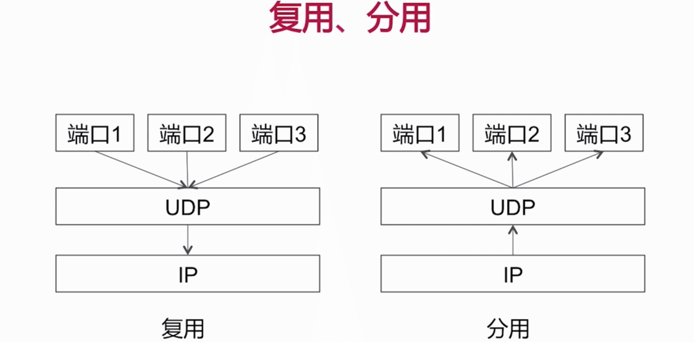
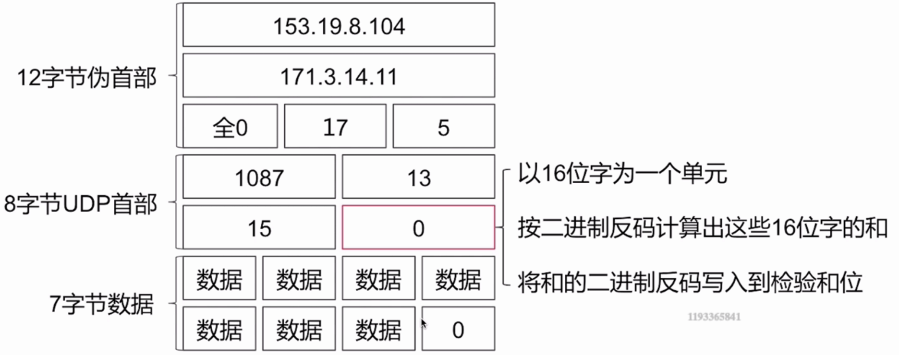
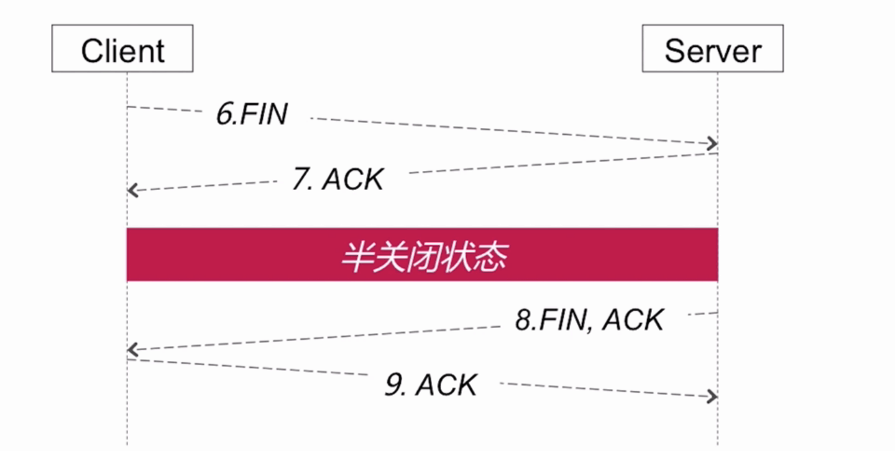
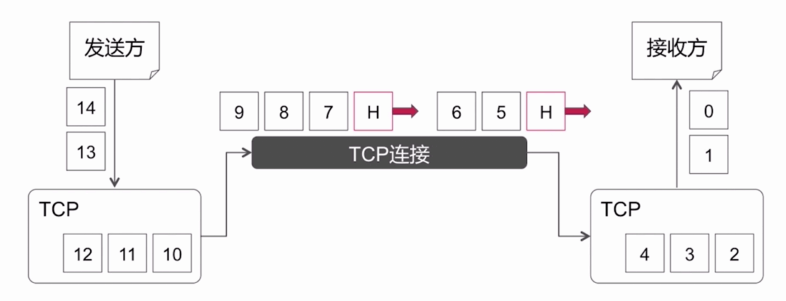
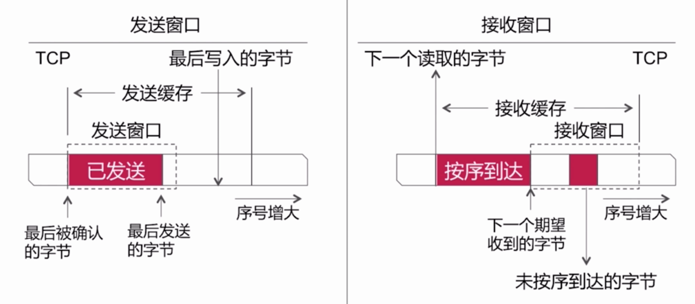
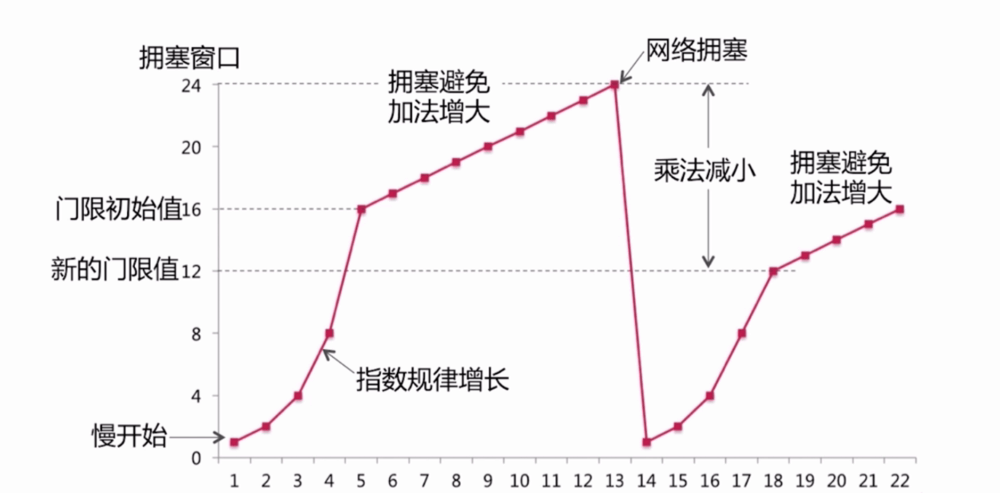

### TCP、UDP相关
#### TCP/UPD协议

 

##### UDP协议

###### 面向报文

##### UDP功能

* 复用、分用

* 差错检测

#### TCP相关

##### 面向连接

* 三次握手
 
 
 
*  四次挥手

 
##### 可靠传输
* 无差错
* 不丢失
* 不重复
* 按序到达

**停止等待协议**:

##### 面向字节流
 

##### 流量控制
 **滑动窗口协议**
 
 
 
 由接收窗口通过tcp里面的报文、首部字段当中来调整、或更改发送窗口的大小 发送的速率。
 
 
##### 拥塞控制

**慢开始、拥塞避免**

**快恢复、快重传**
 
 
 
 