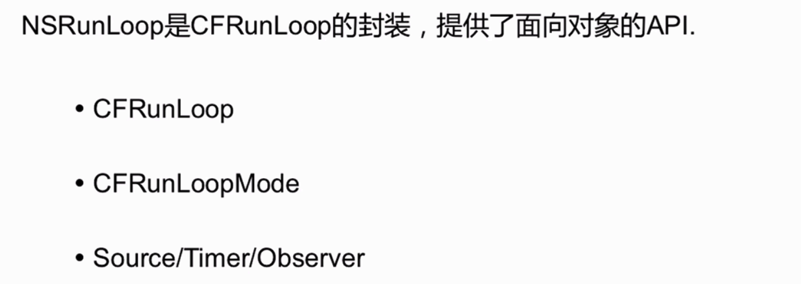
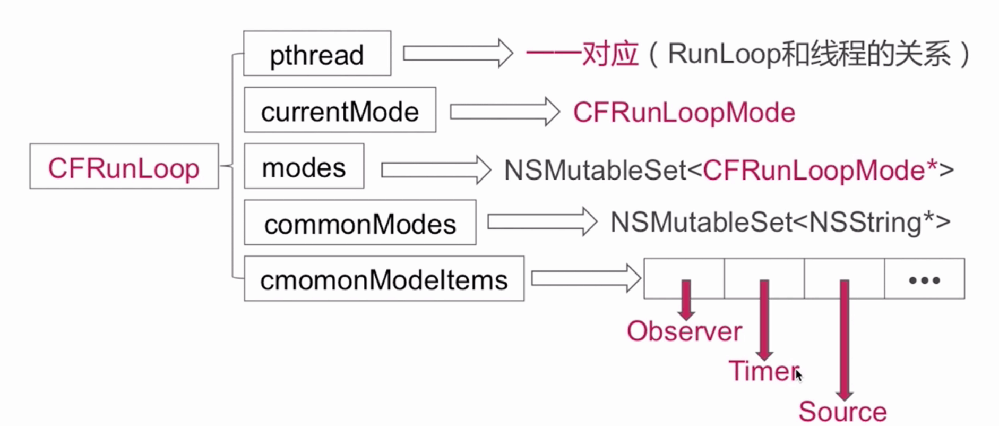
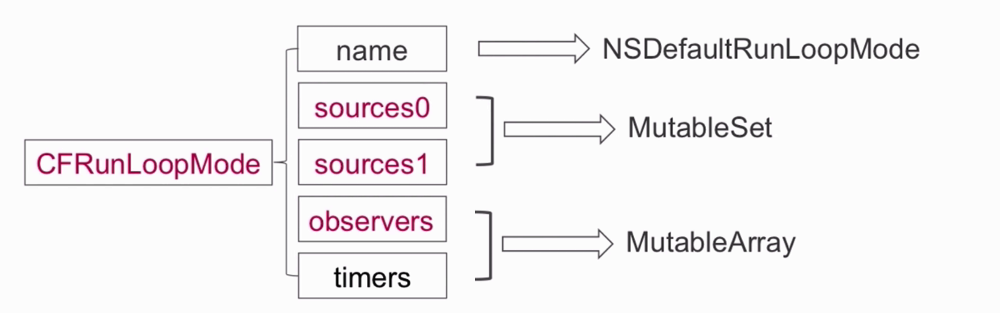
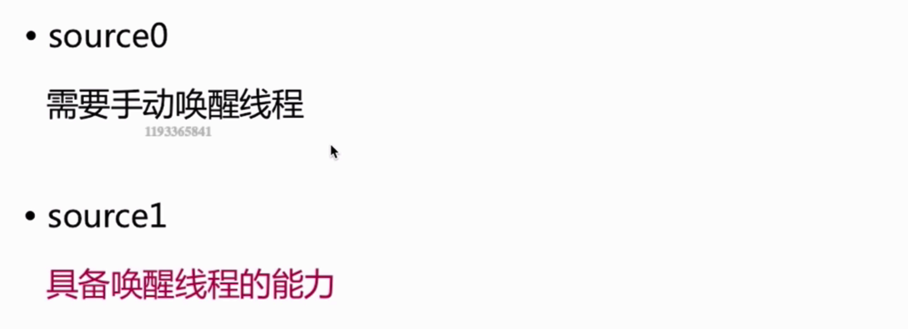
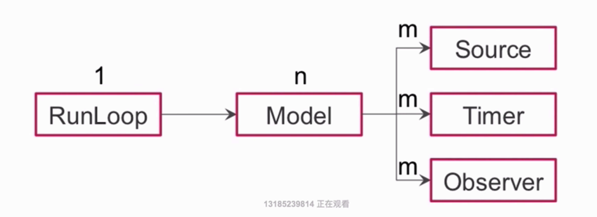
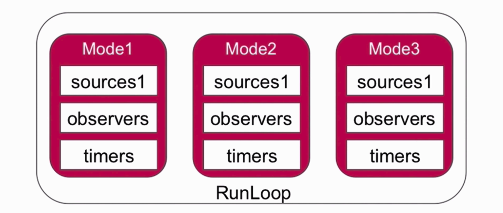
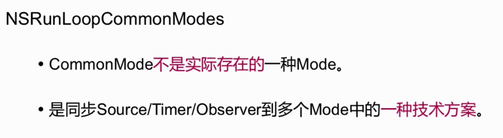
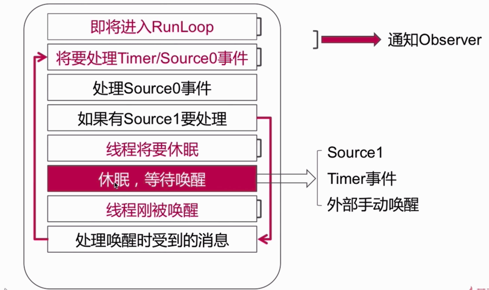
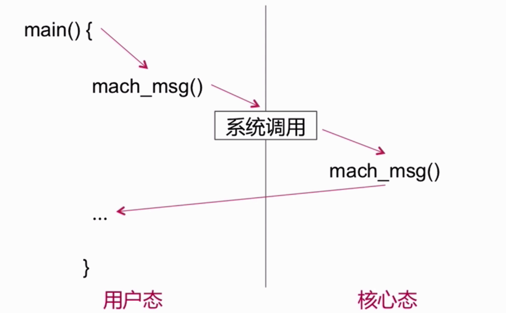

### RunLoop数据结构相关
 
 
 

#### 数据结构
 
 
 
 
 
#### CFRunLoopMode



#### CFRunLoopSource



#### CFRunLoopTimer


#### CFRunLoopObserver
* kCFRunLoopEntry: 即将进入Loop
* kCFRunLoopBeforeTimers:即将处理 Timer
* kCFRunLoopBeforeSources:即将处理 Source
* kCFRunLoopBeforeWaiting:即将进入休眠
* kCFRunLoopAfterWaiting:刚从休眠中唤醒
* kCFRunLoopExit:即将退出Loop
* kCFRunLoopAllActivities:all

#### 各个数据结构之间的关系



#### RunLoop的mode



#### NSRunLoopCommonModes



### RunnLoop事件循环机制




点击应用图标启动之后,会首先调用**main**函数。然后会调用 [UIApplicationMain](https://developer.apple.com/documentation/uikit/3024473-uiapplicationmain)函数。

在**UIApplicationMain**函数内部,会启动主线程的runloop.然后经过一系列的处理后,主线程的runloop进入休眠状态。

如果此时,我们点击屏幕,则会产生一个Mach port,最终会转成一个source1,然后把主线程唤醒，处理。 当我们把应用杀死,也会出现runloop的退出,即时也会发出一个通知。 


#### Runloop的核心

 
 
### RunLoop与多线程
* 线程和runloop是一一对应的
* 自己创建的线程默认是没有runloop的

#### 怎么实现一个常驻的线程

1. 为当前线程开启一个RunLoop
2. 向该RunLoop添加一个Pore/Source等维持RunLoop的时间循环
3. 启动该Runloop


#####  代码实现


```objective-c

#import "MCObject.h"

@implementation MCObject

static NSThread *thread = nil;
// 标记是否要继续事件循环
static BOOL runAlways = YES;

+ (NSThread *)threadForDispatch{
    if (thread == nil) {
        @synchronized(self) {
            if (thread == nil) {
                // 线程的创建
                thread = [[NSThread alloc] initWithTarget:self selector:@selector(runRequest) object:nil];
                [thread setName:@"com.imooc.thread"];
                //启动
                [thread start];
            }
        }
    }
    return thread;
}

+ (void)runRequest
{
    // 创建一个Source
    CFRunLoopSourceContext context = {0, NULL, NULL, NULL, NULL, NULL, NULL, NULL, NULL, NULL};
    CFRunLoopSourceRef source = CFRunLoopSourceCreate(kCFAllocatorDefault, 0, &context);
    
    // 创建RunLoop，同时向RunLoop的DefaultMode下面添加Source
    CFRunLoopAddSource(CFRunLoopGetCurrent(), source, kCFRunLoopDefaultMode);
    
    // 如果可以运行
    while (runAlways) {
        @autoreleasepool {
            // 令当前RunLoop运行在DefaultMode下面
            CFRunLoopRunInMode(kCFRunLoopDefaultMode, 1.0e10, true);
        }
    }
    
    // 某一时机 静态变量runAlways = NO时 可以保证跳出RunLoop，线程退出
    CFRunLoopRemoveSource(CFRunLoopGetCurrent(), source, kCFRunLoopDefaultMode);
    CFRelease(source);
}

@end

```