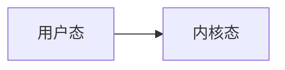
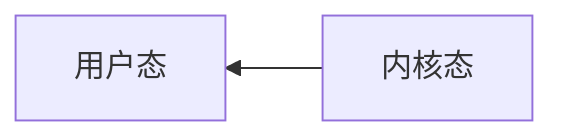

### [Runloop概念](https://lvchenqiang.github.io/lvchenqiang.github.io/2017/02/26/Runloop%E8%AF%A6%E8%A7%A3/)
 RunLoop是通过内部维护的**事件循环**来对**事件/消息进行管理**的一个对象。
 
**ps: 状态的切换**
 
 
 
```
    // 创建Observer
    CFRunLoopObserverRef observer = CFRunLoopObserverCreateWithHandler(kCFAllocatorDefault, kCFRunLoopAllActivities, YES, 0, ^(CFRunLoopObserverRef observer, CFRunLoopActivity activity) {
        switch (activity) {
            case kCFRunLoopEntry: {
                CFRunLoopMode mode = CFRunLoopCopyCurrentMode(CFRunLoopGetCurrent());
                NSLog(@"kCFRunLoopEntry - %@", mode);
                CFRelease(mode);
                break;
            }
                
            case kCFRunLoopExit: {
                CFRunLoopMode mode = CFRunLoopCopyCurrentMode(CFRunLoopGetCurrent());
                NSLog(@"kCFRunLoopExit - %@", mode);
                CFRelease(mode);
                break;
            }
                
            default:
                break;
        }
    });
    // 添加Observer到RunLoop中
    CFRunLoopAddObserver(CFRunLoopGetMain(), observer, kCFRunLoopCommonModes);
    // 释放
    CFRelease(observer);
```
##### 事件循环
没有消息要处理的时候,休眠以避免资源占用。




有消息需要处理的时候,立刻被唤醒。



应用程序在运行的时候,一般都是在运行在用户态。也就是用户进程,开发的绝大数的API等都是出于用户态。而当我们发生了系统的调用,需要到使用一些操作系统、 内核相关的指令。就会触发系统调用,此时就会产生用户态到内核态的切换。这样的切换是为了,资源的统一的调度,统一资源的管理,避免一些特殊的异常。如线程中断。 

#### 基本作用

#####  保持程序的持续运行,程序并不会马上退出，而是保持运行状态
##### 处理App中的各种事件（比如触摸事件、定时器事件等）
##### 节省CPU资源，提高程序性能：该做事时做事，该休息时休息
##### ......

#### RunLoop的运行逻辑

##### Source0
触摸事件处理
performSelector:onThread:

##### Source1
基于Port的线程间通信
系统事件捕捉

##### Timers
NSTimer
performSelector:withObject:afterDelay:

##### Observers
用于监听RunLoop的状态
UI刷新（BeforeWaiting）
Autorelease pool（BeforeWaiting）


```
01、通知Observers：进入Loop
02、通知Observers：即将处理Timers
03、通知Observers：即将处理Sources
04、处理Blocks
05、处理Source0（可能会再次处理Blocks）
06、如果存在Source1，就跳转到第8步
07、通知Observers：开始休眠（等待消息唤醒）
08、通知Observers：结束休眠（被某个消息唤醒）
01> 处理Timer
02> 处理GCD Async To Main Queue
03> 处理Source1
09、处理Blocks
10、根据前面的执行结果，决定如何操作
01> 回到第02步
02> 退出Loop
11、通知Observers：退出Loop

```


#### 应用范畴

##### 定时器（Timer）、PerformSelector

.h
```
#import <Foundation/Foundation.h>

typedef void (^LYUPermenantThreadTask)(void);

@interface LYUPermenantThread : NSObject

/**
 开启线程
 */
//- (void)run;

/**
 在当前子线程执行一个任务
 */
- (void)executeTask:(LYUPermenantThreadTask)task;

/**
 结束线程
 */
- (void)stop;

@end
```


.m


```

#import "LYUPermenantThread.h"

/** LYUThread **/
@interface LYUThread : NSThread
@end
@implementation LYUThread
- (void)dealloc
{
    NSLog(@"%s", __func__);
}
@end

/** LYUPermenantThread **/
@interface LYUPermenantThread()
@property (strong, nonatomic) LYUThread *innerThread;
@end

@implementation LYUPermenantThread
#pragma mark - public methods
- (instancetype)init
{
    if (self = [super init]) {
        self.innerThread = [[LYUThread alloc] initWithBlock:^{
            NSLog(@"begin----");
            
            // 创建上下文（要初始化一下结构体）
            CFRunLoopSourceContext context = {0};
            
            // 创建source
            CFRunLoopSourceRef source = CFRunLoopSourceCreate(kCFAllocatorDefault, 0, &context);
            
            // 往Runloop中添加source
            CFRunLoopAddSource(CFRunLoopGetCurrent(), source, kCFRunLoopDefaultMode);
            
            // 销毁source
            CFRelease(source);
            
            // 启动
            CFRunLoopRunInMode(kCFRunLoopDefaultMode, 1.0e10, false);
            
//            while (weakSelf && !weakSelf.isStopped) {
//                // 第3个参数：returnAfterSourceHandled，设置为true，代表执行完source后就会退出当前loop
//                CFRunLoopRunInMode(kCFRunLoopDefaultMode, 1.0e10, true);
//            }
            
            NSLog(@"end----");
        }];
        
        [self.innerThread start];
    }
    return self;
}

//- (void)run
//{
//    if (!self.innerThread) return;
//
//    [self.innerThread start];
//}

- (void)executeTask:(LYUPermenantThreadTask)task
{
    if (!self.innerThread || !task) return;
    
    [self performSelector:@selector(__executeTask:) onThread:self.innerThread withObject:task waitUntilDone:NO];
}

- (void)stop
{
    if (!self.innerThread) return;
    
    [self performSelector:@selector(__stop) onThread:self.innerThread withObject:nil waitUntilDone:YES];
}

- (void)dealloc
{
    NSLog(@"%s", __func__);
    
    [self stop];
}

#pragma mark - private methods
- (void)__stop
{
    CFRunLoopStop(CFRunLoopGetCurrent());
    self.innerThread = nil;
}

- (void)__executeTask:(LYUPermenantThreadTask)task
{
    task();
}

@end

```
##### GCD Async Main Queue
##### 事件响应、手势识别、界面刷新
##### 网络请求
##### AutoreleasePool

#### RunLoop在实际开中的应用

1. 控制线程生命周期（线程保活）
2. 解决NSTimer在滑动时停止工作的问题
3. 监控应用卡顿
4. 性能优化

