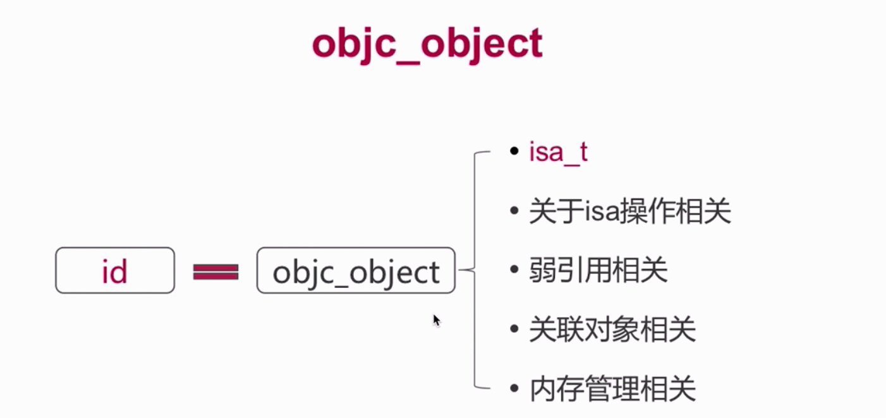
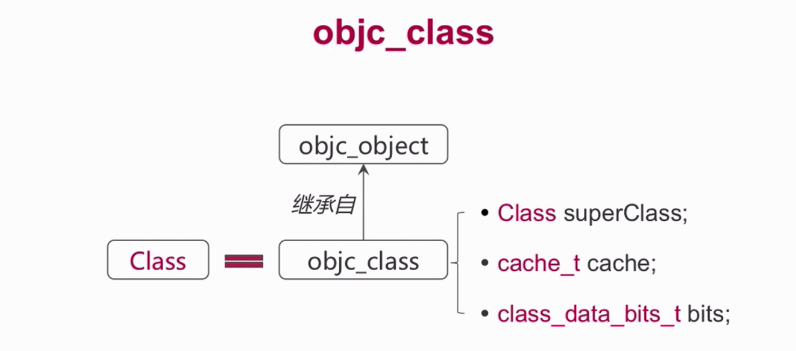
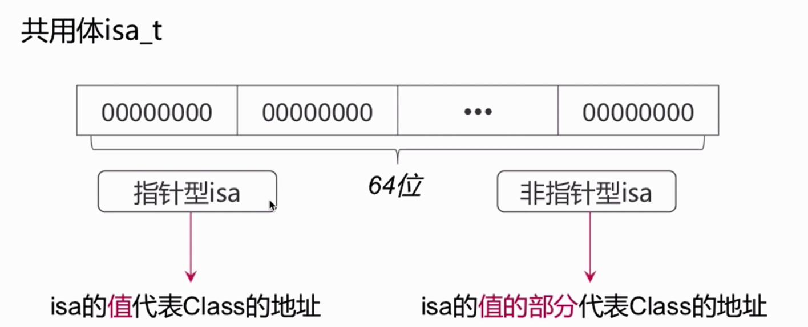
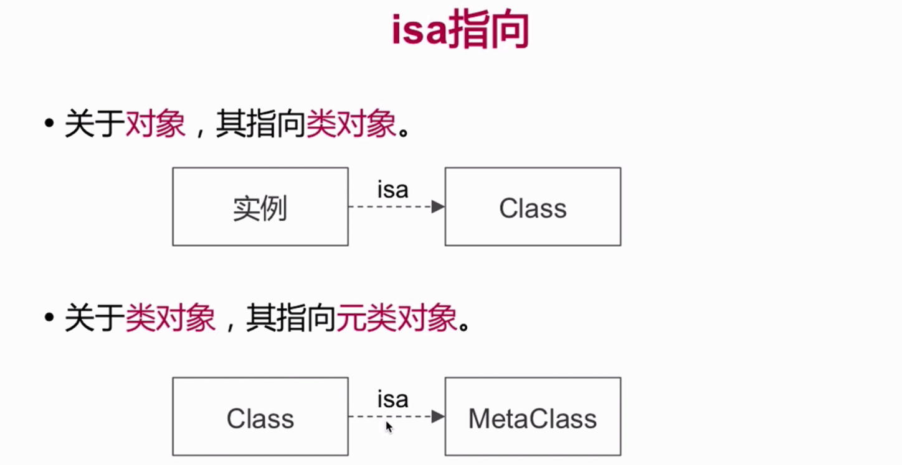
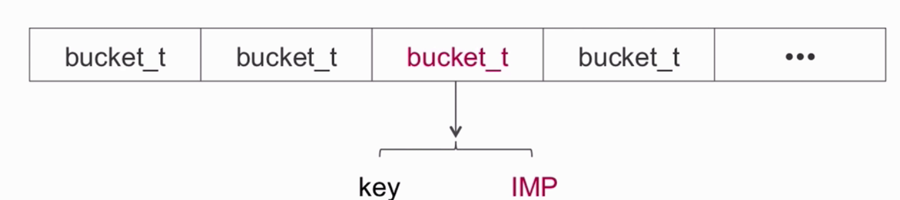
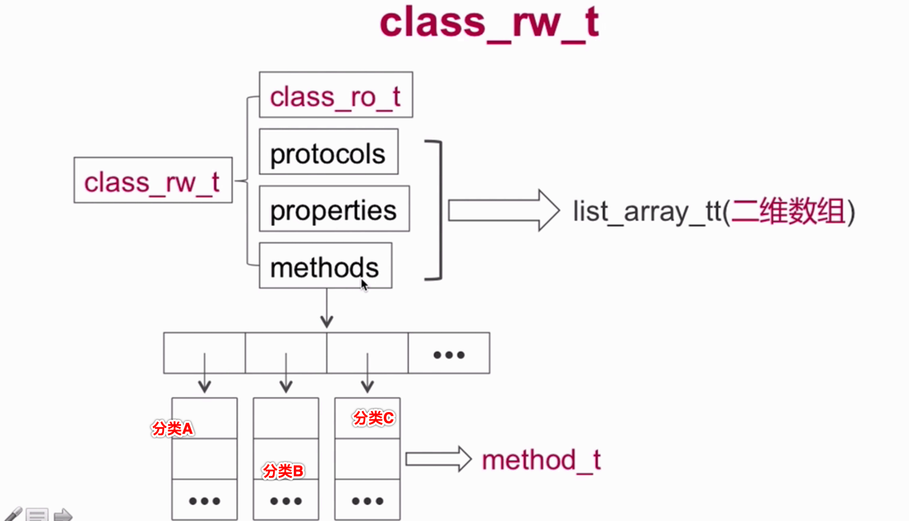
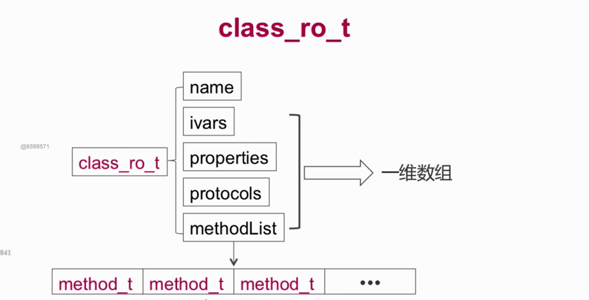
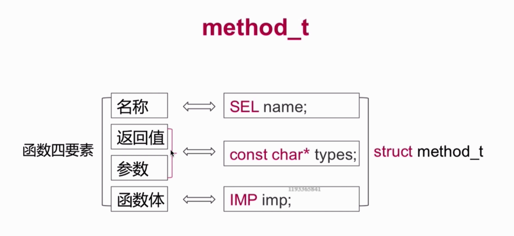
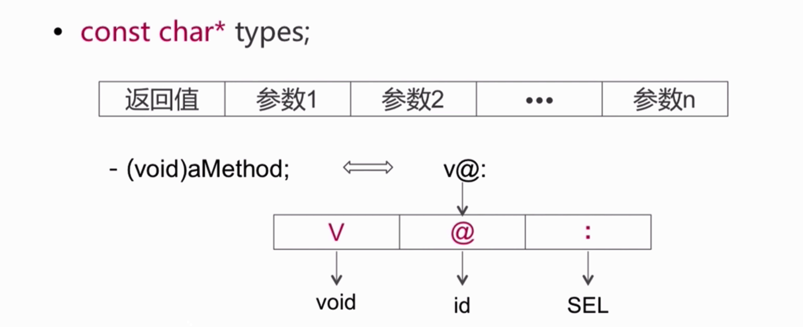

### Runtime的相关面试题
#### Runtime的数据结构
##### objc_object

在objc_object的结构体中,
* isa_t 是一个共用体
* 关于isa的操作, 比如通过是实例对象的isa指针获取类对象,通过类对象的isa指针获取元类对象
* 弱引用相关的方法, 比如:标记一个对象是否曾经有过弱引用
* 关联对象相关 比如:我们为这个对象设置了一些关联属性,那么关联属性的相关方法也在这里可以获取
* 内存管理: 内存管理的一些实现,比如:retain、release等

##### objc_class

首先objc_class继承自objc_object，所以也是一个对象。
* superClass 对应的父类
* cache 方法的缓存,进行消息的传递
* bits 关于对象的信息 变量属性、方法、协议等。

##### isa指针

共用体isa_t:32位或者64位的0或1.

##### isa指针的指向

##### cache_t

cache_t实际就是:
1. 用于快速查找方法执行的函数
2. 是可增量扩展的哈希表结构(提高查找效率)
3. 是计算机**局部性原理**的最佳应用

#####  class_data_bits_t

* **class_data_bits_t** 主要是对class_rw_t的封装
* **class_rw_t** 代表了类相关的读写信息、对class_ro_t的封装
* **class_ro_t** 代表了类相关的只读信息

##### class_rw_t

class_rw_t的methods等一般是一个二维数组，里面一般是存储着各个分类所对应的方法了列表、属性列表、协议列表。
##### class_ro_t

class_ro_t 作为类的只读数据,methodList等对应的一般是以为数组,包含了宿主类本身的方法列表、属性列表、协议列表等。

##### method_t

##### Type Encodings

[更多 Type Encodings :](https://developer.apple.com/library/archive/documentation/Cocoa/Conceptual/ObjCRuntimeGuide/Articles/ocrtTypeEncodings.html#//apple_ref/doc/uid/TP40008048-CH100-SW1)