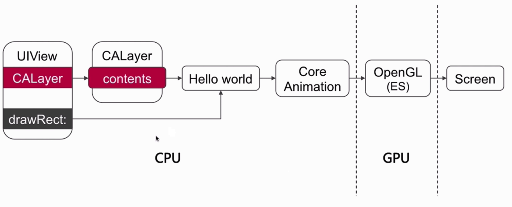
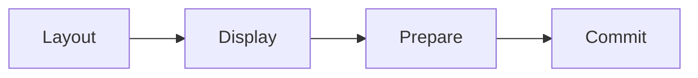
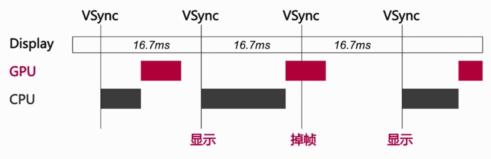
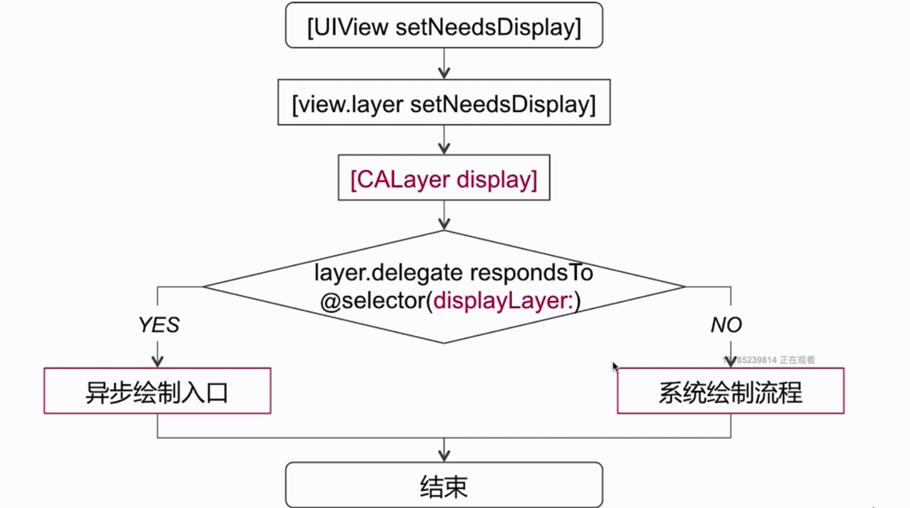
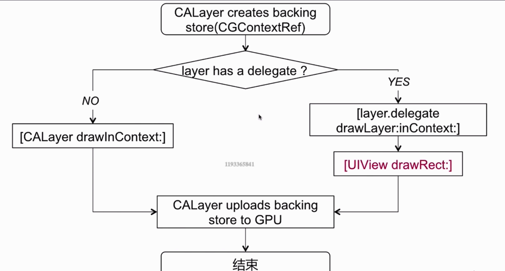
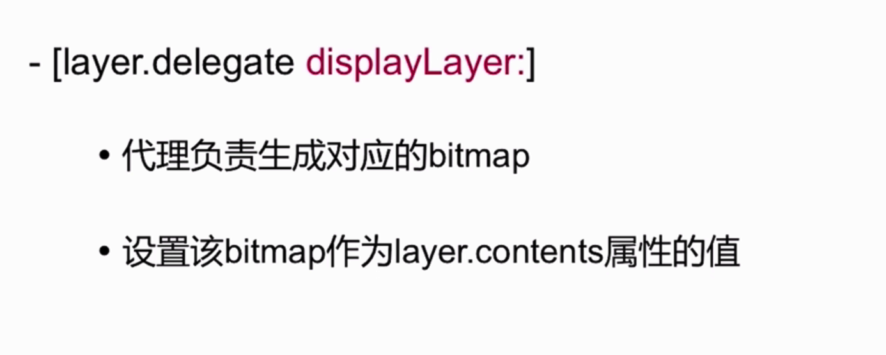

### 图像的显示原理

#### CPU的工作

* Layout: UI布局、文本计算等
 此阶段主要是准备你的视图/图层的层级关系,以及设置图层属性(位置,背景色,边框等等)
 
* Displa:绘制过程、drawRect:调用
 此阶段是图层的寄宿图片被绘制的阶段。

* Prepare:图片的解码、动画过程中将要显示的图片的时间点
 此阶段Core Animation准备发送动画数据到渲染服务的阶段

* Commit:提交位图。
最后的阶段，Core Animation打包所有图层和动画属性,然后通过IPC(内部处理通信)发送到渲染服务进行显示。

#### GPU渲染管线

顶点着色主要是对位图进行处理。

当上诉步骤处理完毕之后,会提交到帧缓存区[FrameBuffer]，然后由视频控制器有Vsync信号到来之前去帧缓存区提取将要显示到屏幕上的内容。

### UI卡顿、掉帧的原因

在规定的16.7ms的时间内,cpu和gpu在这个时间内，没有完成下一帧画面的合成。

#### 滑动的优化方案
CPU:
* 在子线程中处理对象的创建、调整、销毁。
* 在子线程中提前处理预排版(布局计算、文本计算)
* 预渲染(文本的异步绘制,图片编解码等)

GPU:
* 纹理渲染 尽量避免离屏渲染、以及CPU预渲染减轻GPU的压力 避免重绘(主要是因为半透明图层)GPU的填充比率是有限的
* 视图混合 减轻图层的复杂度,避免太多的几何结构
* 避免处理过大的图片 如果图片绘制超出GPU支持的2048X2048 或者 4096X4096尺寸的纹理,则必须在显示之前进行预处理

#### 绘制原理

当我们在调用 setNeedsDisplay的时候,并不会立即触发渲染而是会调用layer的同名方法给layer打上脏标记,然后在当前runloop接触的时候，调用 display.

##### 系统的绘制流程

backing store 我们可以理解为合成了bitmap(位图)。

##### 异步绘制的流程

实现的过程:

#### 离屏渲染
触发离屏渲染会增加GPU的工作量,而增加了GPU的工作量可能会导致CPU和GPU的工作总耗时超过了16.7ms，有可能会导致UI的卡顿和掉帧。