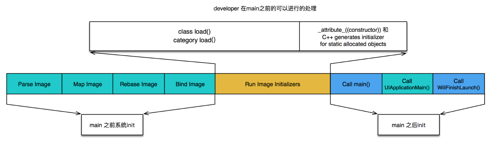
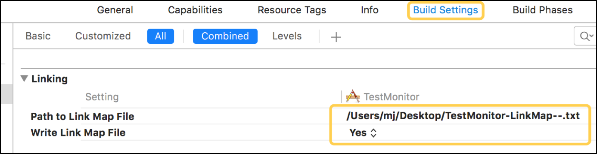

### 性能相关
####  卡顿优化
##### 卡顿优化 - CPU
1. 尽量用轻量级的对象，比如用不到事件处理的地方，可以考虑使用CALayer取代UIView

2. 不要频繁地调用UIView的相关属性，比如frame、bounds、transform等属性，尽量减少不必要的修改

3. 尽量提前计算好布局，在有需要时一次性调整对应的属性，不要多次修改属性

4. Autolayout会比直接设置frame消耗更多的CPU资源

5. 图片的size最好刚好跟UIImageView的size保持一致

6. 控制一下线程的最大并发数量

7. 尽量把耗时的操作放到子线程
8. 文本处理（尺寸计算、绘制）
9. 图片处理（解码、绘制）


**检测工具:https://github.com/UIControl/LXDAppFluecyMonitor**
##### 卡顿优化 - GPU

1. 尽量避免短时间内大量图片的显示，尽可能将多张图片合成一张进行显示

2. GPU能处理的最大纹理尺寸是4096x4096，一旦超过这个尺寸，就会占用CPU资源进行处理，所以纹理尽量不要超过这个尺寸

3. 尽量减少视图数量和层次

4. 减少透明的视图（alpha<1），不透明的就设置opaque为YES

5. 尽量避免出现离屏渲染


##### 在OpenGL中，GPU有2种渲染方式
* On-Screen Rendering：当前屏幕渲染，在当前用于显示的屏幕缓冲区进行渲染操作
* Off-Screen Rendering：离屏渲染，在当前屏幕缓冲区以外新开辟一个缓冲区进行渲染操作

##### 离屏渲染消耗性能的原因
* 需要创建新的缓冲区
* 离屏渲染的整个过程，需要多次切换上下文环境，先是从当前屏幕（On-Screen）切换到离屏（Off-Screen）；等到离屏渲染结束以后，将离屏缓冲区的渲染结果显示到屏幕上，又需要将上下文环境从离屏切换到当前屏幕

##### 哪些操作会触发离屏渲染？
* 光栅化，layer.shouldRasterize = YES

* 遮罩，layer.mask

* 圆角，同时设置layer.masksToBounds = YES、layer.cornerRadius大于0
* 考虑通过CoreGraphics绘制裁剪圆角，或者叫美工提供圆角图片

* 阴影，layer.shadowXXX
* 如果设置了layer.shadowPath就不会产生离屏渲染

##### 卡顿检测
* 平时所说的“卡顿”主要是因为在主线程执行了比较耗时的操作

* 可以添加Observer到主线程RunLoop中，通过监听RunLoop状态切换的耗时，以达到监控卡顿的目的

#### 耗电优化
##### 耗电的主要来源
* CPU处理，Processing

* 网络，Networking

* 定位，Location

* 图像，Graphics


##### 耗电优化
###### 尽可能降低CPU、GPU功耗

###### 少用定时器

###### 优化I/O操作
* 尽量不要频繁写入小数据，最好批量一次性写入

* 读写大量重要数据时，考虑用dispatch_io，其提供了基于GCD的异步操作文件I/O的API。用dispatch_io系统会优化磁盘访问数据量比较大的，建议使用数据库（比如SQLite、CoreData）

###### 网络优化
* 减少、压缩网络数据

* 如果多次请求的结果是相同的，尽量使用缓存
使用断点续传，否则网络不稳定时可能多次传输相同的内容

* 网络不可用时，不要尝试执行网络请求
让用户可以取消长时间运行或者速度很慢的网络操作，设置合适的超时时间

* 批量传输，比如，下载视频流时，不要传输很小的数据包，直接下载整个文件或者一大块一大块地下载。如果下载广告，一次性多下载一些，然后再慢慢展示。如果下载电子邮件，一次下载多封，不要一封一封地下载

###### 定位优化
* 如果只是需要快速确定用户位置，最好用CLLocationManager的requestLocation方法。定位完成后，会自动让定位硬件断电
* 如果不是导航应用，尽量不要实时更新位置，定位完毕就关掉定位服务
* 尽量降低定位精度，比如尽量不要使用精度最高的kCLLocationAccuracyBest
* 需要后台定位时，尽量设置pausesLocationUpdatesAutomatically为YES，如果用户不太可能移动的时候系统会自动暂停位置更新
* 尽量不要使用startMonitoringSignificantLocationChanges，优先考虑startMonitoringForRegion:

###### 硬件检测优化
用户移动、摇晃、倾斜设备时，会产生动作(motion)事件，这些事件由加速度计、陀螺仪、磁力计等硬件检测。在不需要检测的场合，应该及时关闭这些硬件


#### 启动优化

##### APP的启动可以分为2种
* 冷启动（Cold Launch）：从零开始启动APP

* 热启动（Warm Launch）：APP已经在内存中，在后台存活着，再次点击图标启动APP

##### APP启动时间的优化，主要是针对冷启动进行优化

##### 通过添加环境变量可以打印出APP的启动时间分析（Edit scheme -> Run -> Arguments）
* `DYLD_PRINT_STATISTICS`设置为1
* 如果需要更详细的信息，那就将`DYLD_PRINT_STATISTICS_DETAILS`设置为1

##### APP的冷启动可以概括为3大阶段
1. dyld
2. runtime
3. main




###### APP的启动 - dyld

 **dyld（dynamic link editor），Apple的动态链接器，可以用来装载Mach-O文件（可执行文件、动态库等）**

**启动APP时，dyld所做的事情有**
1.  装载APP的可执行文件，同时会递归加载所有依赖的动态库
2. 当dyld把可执行文件、动态库都装载完毕后，会通知Runtime进行下一步的处理


###### APP的启动 - runtime
**启动APP时，runtime所做的事情有**
1. 调用map_images进行可执行文件内容的解析和处理
2. 在load_images中调用call_load_methods，调用所有Class和Category的+load方法
3. 进行各种objc结构的初始化（注册Objc类 、初始化类对象等等）
4. 调用C++静态初始化器和__attribute__((constructor))修饰的函数

**到此为止，可执行文件和动态库中所有的符号(Class，Protocol，Selector，IMP，…)都已经按格式成功加载到内存中，被runtime 所管理**

###### APP的启动 - main
**总结一下**
1. APP的启动由dyld主导，将可执行文件加载到内存，顺便加载所有依赖的动态库
2. 并由runtime负责加载成objc定义的结构
3. 所有初始化工作结束后，dyld就会调用main函数
4. 接下来就是UIApplicationMain函数，AppDelegate的application:didFinishLaunchingWithOptions:方法


###### APP的启动优化
**按照不同的阶段**
* dyld

```

减少动态库、合并一些动态库（定期清理不必要的动态库）

减少Objc类、分类的数量、减少Selector数量（定期清理不必要的类、分类）

减少C++虚函数数量

Swift尽量使用struct

```

* runtime

```
用+initialize方法和dispatch_once取代所有的__attribute__((constructor))、C++静态构造器、ObjC的+load

```

* main

```
在不影响用户体验的前提下，尽可能将一些操作延迟，不要全部都放在finishLaunching方法中
按需加载
```


#### 安装包优化
##### 安装包瘦身

###### 安装包（IPA）主要由可执行文件、资源组成

###### 资源（图片、音频、视频等）
1. 采取无损压缩
2. 去除没有用到的资源： https://github.com/tinymind/LSUnusedResources

###### 可执行文件瘦身
1. 编译器优化
Strip Linked Product、Make Strings Read-Only、Symbols Hidden by Default设置为YES
去掉异常支持，Enable C++ Exceptions、Enable Objective-C Exceptions设置为NO， Other C Flags添加-fno-exceptions

2. 利用AppCode（https://www.jetbrains.com/objc/）检测未使用的代码：菜单栏 -> Code -> Inspect Code

3. 编写LLVM插件检测出重复代码、未被调用的代码


##### LinkMap
###### 生成LinkMap文件，可以查看可执行文件的具体组成



###### 可借助第三方工具解析LinkMap文件： https://github.com/huanxsd/LinkMap


