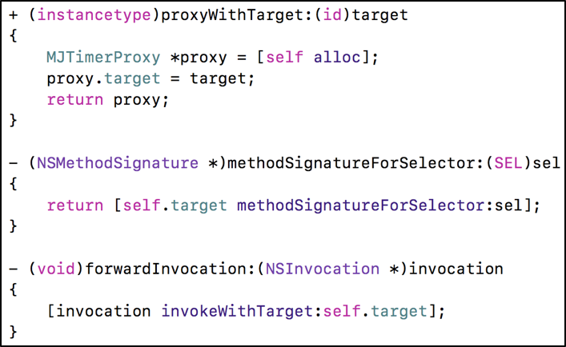
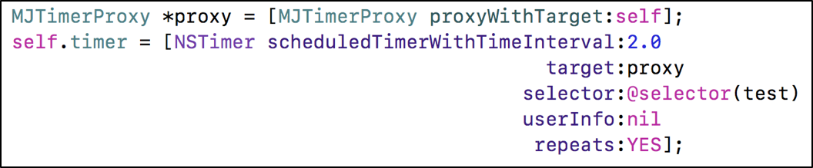

### 定时器相关

#### CADisplayLink、NSTimer使用注意

**CADisplayLink**、**NSTimer**会对**target**产生强引用，如果target又对它们产生强引用，那么就会引发循环引用

解决方案
##### 使用block


##### 使用代理对象（NSProxy）







#### GCD定时器

* NSTimer依赖于RunLoop，如果RunLoop的任务过于繁重，可能会导致NSTimer不准时

* 而GCD的定时器会更加准时


LYUTimer.h

```
#import <Foundation/Foundation.h>

@interface LYUTimer : NSObject

+ (NSString *)execTask:(void(^)(void))task
           start:(NSTimeInterval)start
        interval:(NSTimeInterval)interval
         repeats:(BOOL)repeats
           async:(BOOL)async;

+ (NSString *)execTask:(id)target
              selector:(SEL)selector
                 start:(NSTimeInterval)start
              interval:(NSTimeInterval)interval
               repeats:(BOOL)repeats
                 async:(BOOL)async;

+ (void)cancelTask:(NSString *)name;

@end
```

 LYUTimer.m
 
 
```

#import "LYUTimer.h"

@implementation LYUTimer

static NSMutableDictionary *timers_;
dispatch_semaphore_t semaphore_;
+ (void)initialize
{
    static dispatch_once_t onceToken;
    dispatch_once(&onceToken, ^{
        timers_ = [NSMutableDictionary dictionary];
        semaphore_ = dispatch_semaphore_create(1);
    });
}

+ (NSString *)execTask:(void (^)(void))task start:(NSTimeInterval)start interval:(NSTimeInterval)interval repeats:(BOOL)repeats async:(BOOL)async
{
    if (!task || start < 0 || (interval <= 0 && repeats)) return nil;
    
    // 队列
    dispatch_queue_t queue = async ? dispatch_get_global_queue(0, 0) : dispatch_get_main_queue();
    
    // 创建定时器
    dispatch_source_t timer = dispatch_source_create(DISPATCH_SOURCE_TYPE_TIMER, 0, 0, queue);
    
    // 设置时间
    dispatch_source_set_timer(timer,
                              dispatch_time(DISPATCH_TIME_NOW, start * NSEC_PER_SEC),
                              interval * NSEC_PER_SEC, 0);
    
    
    dispatch_semaphore_wait(semaphore_, DISPATCH_TIME_FOREVER);
    // 定时器的唯一标识
    NSString *name = [NSString stringWithFormat:@"%zd", timers_.count];
    // 存放到字典中
    timers_[name] = timer;
    dispatch_semaphore_signal(semaphore_);
    
    // 设置回调
    dispatch_source_set_event_handler(timer, ^{
        task();
        
        if (!repeats) { // 不重复的任务
            [self cancelTask:name];
        }
    });
    
    // 启动定时器
    dispatch_resume(timer);
    
    return name;
}

+ (NSString *)execTask:(id)target selector:(SEL)selector start:(NSTimeInterval)start interval:(NSTimeInterval)interval repeats:(BOOL)repeats async:(BOOL)async
{
    if (!target || !selector) return nil;
    
    return [self execTask:^{
        if ([target respondsToSelector:selector]) {
#pragma clang diagnostic push
#pragma clang diagnostic ignored "-Warc-performSelector-leaks"
            [target performSelector:selector];
#pragma clang diagnostic pop
        }
    } start:start interval:interval repeats:repeats async:async];
}

+ (void)cancelTask:(NSString *)name
{
    if (name.length == 0) return;
    
    dispatch_semaphore_wait(semaphore_, DISPATCH_TIME_FOREVER);
    
    dispatch_source_t timer = timers_[name];
    if (timer) {
        dispatch_source_cancel(timer);
        [timers_ removeObjectForKey:name];
    }

    dispatch_semaphore_signal(semaphore_);
}

@end

```