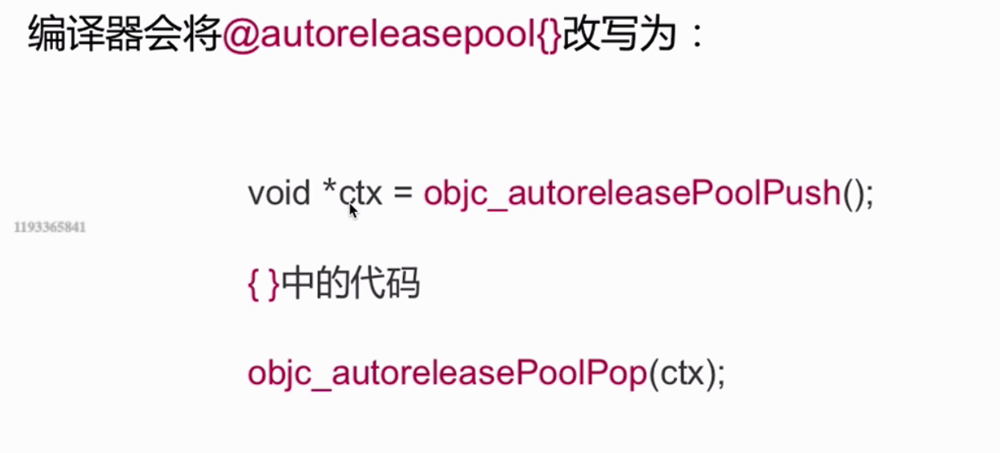
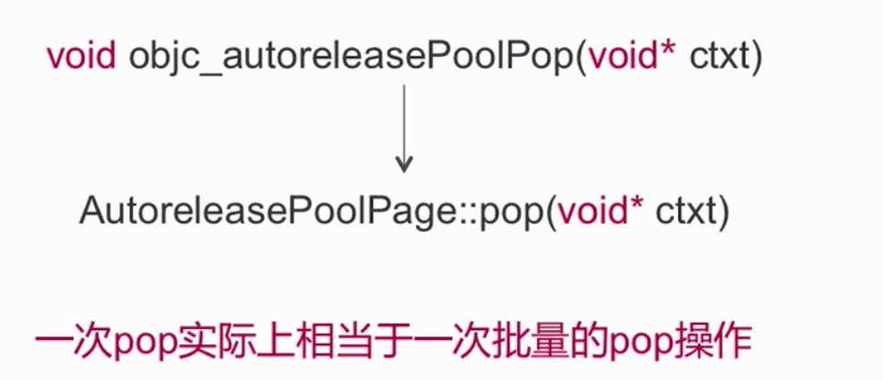
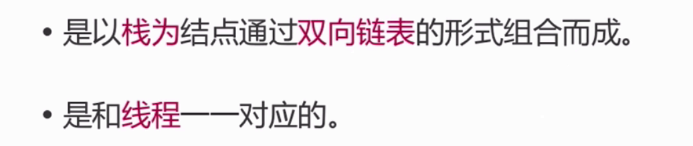
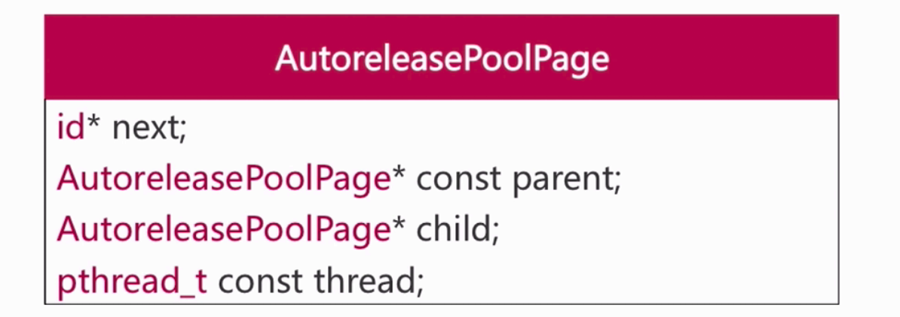
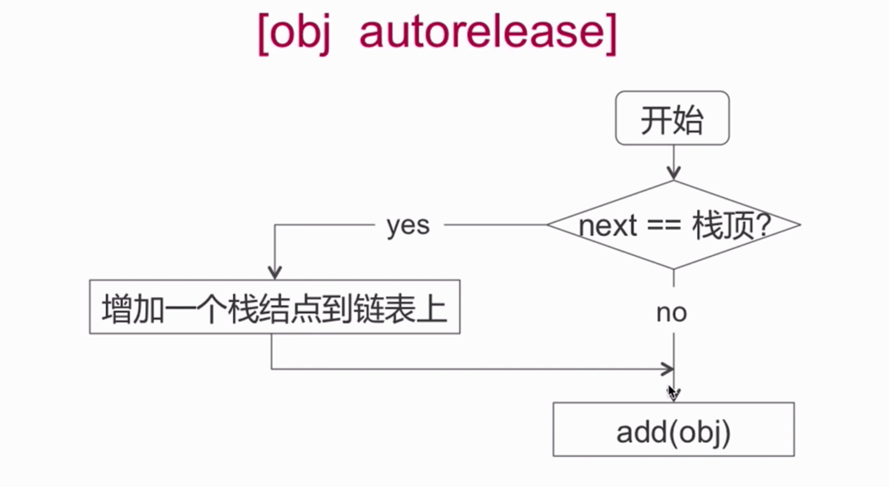
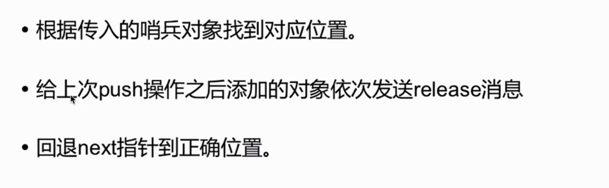
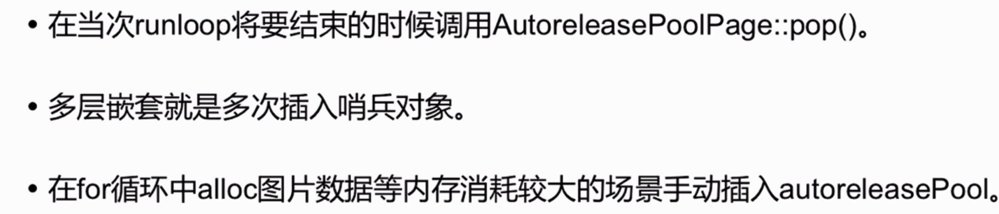

### [自动释放池相关](https://github.com/draveness/analyze/blob/master/contents/objc/%E8%87%AA%E5%8A%A8%E9%87%8A%E6%94%BE%E6%B1%A0%E7%9A%84%E5%89%8D%E4%B8%96%E4%BB%8A%E7%94%9F.md)

#### Autoreleasepool的实现原理

 
##### objc_autoreleasePoolPush

##### objc_autoreleasePoolPop

#### Autoreleasepool的数据结构

 
 
 
 
 
 

##### objc autorelease 流程

 
 
#### AutoReleasePoolPage:Pop

#### 面试点
什么时候自定释放池释放？
为什么可以多层嵌套？
应用场景？

