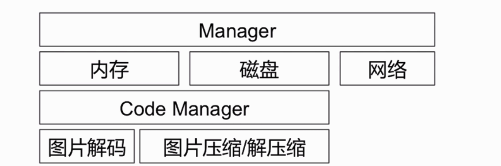
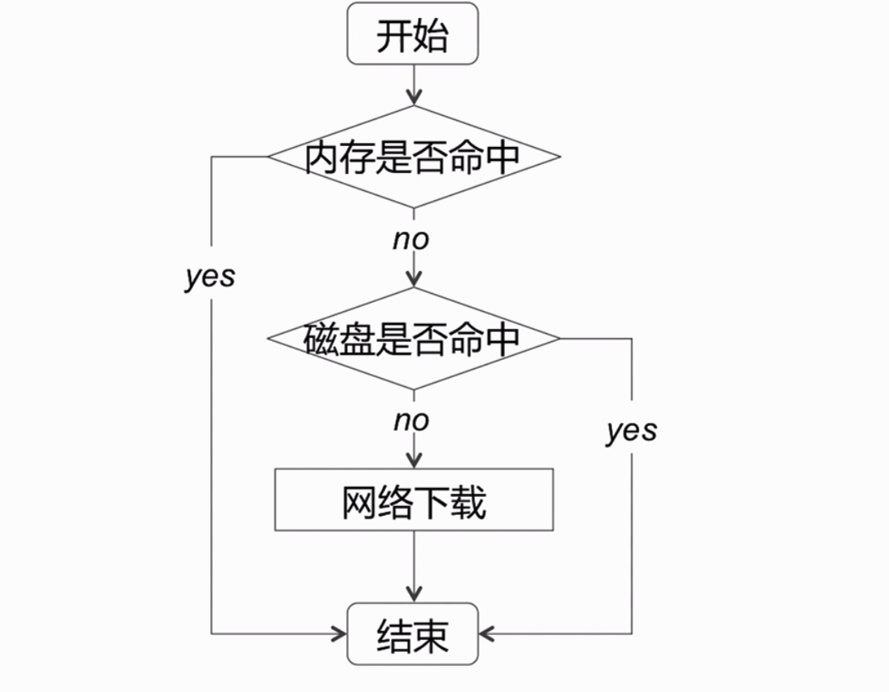
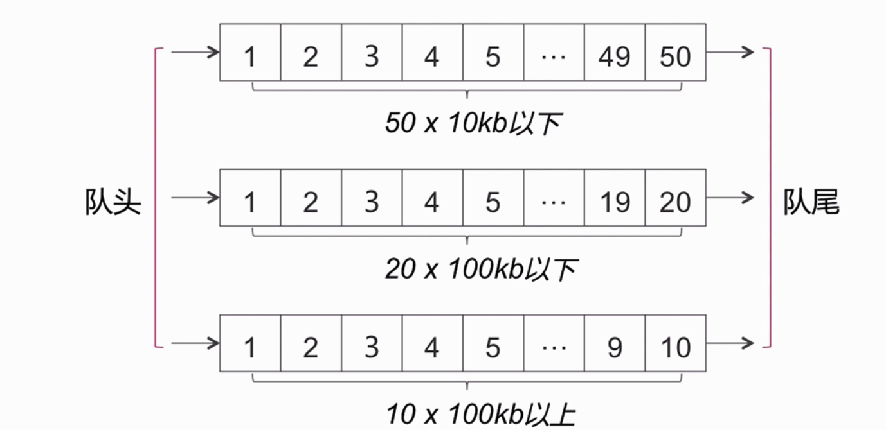
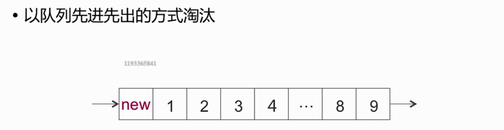
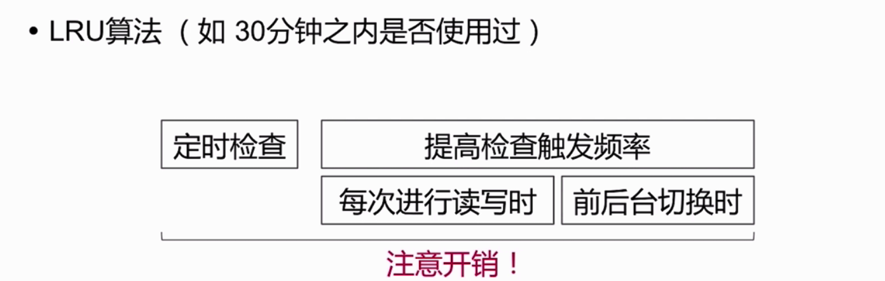
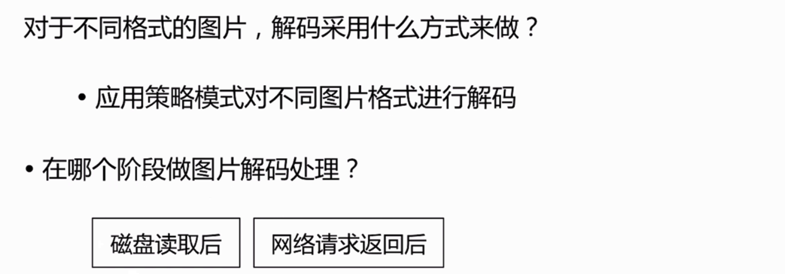

### 架构框架相关

#### 架构框架相关目的
* 模块化
* 分层
* 解耦
* 降低代码重合度


#### 设计图片缓存框架



#### 图片读写

* 以图片URL的单向Hash值作为key

**多级缓存设计:**


#### 内存设计的问题
* 存储的size
* 淘汰策略


#####  存储的size

##### 淘汰策略







#### 磁盘设计
* 存储方式
* 大小限制
* 淘汰策略

#### 网络设计
* 图片请求最大并发量
* 请求超时策略
* 请求的优先级

#### 图片解码




#### 线程处理


#### 设计模式
##### 设计模式（Design Pattern）
1. 是一套被反复使用、代码设计经验的总结
使用设计模式的好处是：可重用代码、让代码更容易被他人理解、保证代码可靠性
2. 一般与编程语言无关，是一套比较成熟的编程思想

##### 设计模式可以分为三大类

```
创建型模式：对象实例化的模式，用于解耦对象的实例化过程
单例模式、工厂方法模式，等等

```


```
结构型模式：把类或对象结合在一起形成一个更大的结构
代理模式、适配器模式、组合模式、装饰模式，等等
```


```
行为型模式：类或对象之间如何交互，及划分责任和算法
观察者模式、命令模式、责任链模式，等等
```


**架构与设计模式**

https://github.com/skyming/Trip-to-iOS-Design-Patterns

https://design-patterns.readthedocs.io/zh_CN/latest/

 