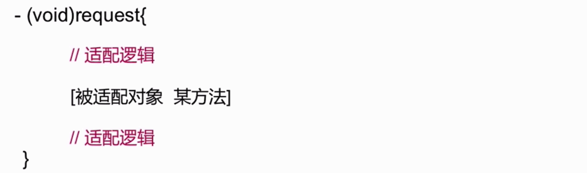

### 设计模式相关

#### 责任链模式相关
责任链模式的主要思想是,对象引用了同一类型的另一个对象，形成一条链。链中的每一个对象实现了同样的方法,处理对链中第一个对象发起的同一个请求。如果对象不知道该如何处理请求,则它把请求传给下一个响应器。

##### 使用场景
* 有多个对象可以处理请求,而处理程序只有在运行时才能确定。
* 向一组对象发起请求,而不想显示指定处理请求的特定处理程序。

##### 使用示例
**UIKit** 事件响应

#### 桥接模式相关
桥接模式的目的是把抽象层次结构从其实现中分离出来,使其能够独立变更。 
抽象层定义了供客户端使用的上层的抽象接口. 实现层次结构定义了供抽象层次使用的底层接口。实现类的引用被封装于抽象层的实例中时,桥接就形成了。

##### 使用场景
* 不想在抽象与其实现之间形成固定的绑定关系(这样就能在运行时切换实现)
* 抽象及其实现应可以通过子类化独立进行扩展
* 对抽象的实现进行修改不应影响客户端代码
* 如果每个实现需要额外的子类化细化抽象,则说明有必要把它们分成两个部分
* 想在带有不同抽象接口的多个对象之间共享一个实现

##### 使用示例


#### 适配器模式相关
用于连接两种不同种类的对象,使其毫无问题的协同工作。有时它也被称为"包装器".其思想相当简单. 适配器实现客户端所要的某种接口的行为,同时,它又要连接到另一个具有不同接口与行为的对象。

一边是客户端懂得如何使用目的接口,另一边是客户端一无所知的被适配者,适配器站在两者之间。

适配器的主要作用是把适配器的行为传递给管道另一端的客户端。


##### 适配器的使用场景
* 已有类的接口与需求不匹配
* 想要一个可复用的类,该类能够同可能带有不兼容接口的其他类协作
* 需要适配一个类的几个不同子类,可是让每一个子类去子类化一个类适配器又不现实。那么可以使用对象适配器(也叫委托)来适配其父类的接口


| 类适配器 | 对象适配器 |  
| --- | --- | 
|  只针对单一的具体Adaptee类,把Adaptee适配到Target |  可以适配多个Adaptee以及其子类|
| 易于重载Adaptee的行为,因为是通过直接的子类化进行的适配| 难以重载Adaptee的行为,需要借助于子类的对象而不是Adaptee本身 |
|只有一个Adaptee对象,无需额外的指针间接访问Adaptee | 需要额外的指针以间接访问Adaptee并适配其行为|  


**类适配器与对象适配器是实现适配器模式的不同方式,但是达成的目的相同。**


##### 使用示例
一个现有类需要适应变化的问题




#### 单例模式相关
使得类的一个对象成为系统中的唯一实例。

保证一个类仅有一个实例,并提供一个访问它的全局访问点。

##### 使用场景
* 类智能有一个实例,而且必须从一个为人熟知的访问点对其进行访问,比如工厂方法
* 这个唯一的实例只能通过子类化进行扩展,而且扩展的对象不会破坏客户端的代码


##### 使用示例
NSFileManager、NSUserDefault等


```objective-c
+ (id)sharedInstance
{
    // 静态局部变量
    static Mooc *instance = nil;
    
    // 通过dispatch_once方式 确保instance在多线程环境下只被创建一次
    static dispatch_once_t onceToken;
    dispatch_once(&onceToken, ^{
        // 创建实例
        instance = [[super allocWithZone:NULL] init];
    });
    return instance;
}

// 重写方法【必不可少】
+ (id)allocWithZone:(struct _NSZone *)zone{
    return [self sharedInstance];
}

// 重写方法【必不可少】
- (id)copyWithZone:(nullable NSZone *)zone{
    return self;
}
```


#### 命令模式相关


 命令对象封装了如何对目标执行指令的信息,因此客户端或调用者不必了解目标的任何细节,却可以对它执行任何已有的操作。
 
 通过把请求封装成对象,客户端可以把它参数化并置入队列或日志中,也能够支持撤销操作。
 
 命令对象将一个或多个动作绑定到特定的接收器,命令模式消除了作为对象的动作和执行它的接收器之间的绑定。
 
##### 使用场景
* 想让应用程序支持撤销与恢复
* 想用对象参数化一个动作以执行操作,并用不同命令对象来代替回调函数
* 想要在不同时刻对请求进行制定、排列和执行
* 想记录修改日志,这样在系统故障时,这些修改可在后来重做一遍。
* 想让系统支持事务,事务封装了对数据的一系列修改。事务可以建模为命令对象。


##### 使用示例


 